# THIẾT KẾ BOUNDED CONTEXT VÀ KIẾN TRÚC MICROSERVICE – CABSYSTEM

> **Chuỗi thiết kế:**
> **FR → Business Workflow → Bounded Context → Ubiquitous Language → Microservice → API → Entity Model → Database → Data Model → ERD**

---

# X.1. PHÂN TÍCH FUNCTIONAL REQUIREMENTS VÀ BUSINESS WORKFLOW

Việc phân chia hệ thống CabSystem thành các Bounded Context được thực hiện dựa trên Functional Requirements và Business Workflow trong SRS.

## X.1.1. Functional Requirements

| FR   | Chức năng         | Mô tả                                                                   |
| ---- | ----------------- | ----------------------------------------------------------------------- |
| FR01 | Quản lý tài khoản | Đăng ký, đăng nhập và cập nhật thông tin người dùng                     |
| FR02 | Đặt xe            | Nhập điểm đón, điểm đến và chọn loại xe để gửi yêu cầu                  |
| FR03 | Tìm tài xế        | Xác định và ưu tiên tài xế phù hợp, gần khách hàng                      |
| FR04 | Phân công tài xế  | Gửi yêu cầu cho tài xế và tìm tài xế khác nếu bị từ chối                |
| FR05 | Quản lý chuyến đi | Theo dõi và cập nhật trạng thái chuyến đi                               |
| FR06 | Theo dõi vị trí   | Lưu và cập nhật vị trí tài xế để hỗ trợ tìm xe và dự kiến thời gian đến |
| FR07 | Tính cước         | Tính số tiền khách hàng phải trả dựa trên thông tin chuyến đi           |
| FR08 | Thanh toán        | Hỗ trợ thanh toán tiền mặt và thanh toán điện tử                        |
| FR09 | Thông báo         | Gửi thông báo về đặt xe, tài xế, chuyến đi và thanh toán                |
| FR10 | Đánh giá tài xế   | Cho phép khách hàng đánh giá tài xế sau khi hoàn thành chuyến           |
| FR11 | Quản lý vận hành  | Quản lý khách hàng, tài xế, phương tiện và chuyến đi                    |
| FR12 | Báo cáo           | Cung cấp báo cáo về chuyến đi, doanh thu, tỷ lệ hủy và hiệu quả tài xế  |
| FR13 | Phân quyền        | Kiểm soát quyền truy cập các chức năng quản trị                         |
| FR14 | Quản lý lịch sử   | Tra cứu lịch sử chuyến đi và giao dịch                                  |

> **Nguồn phân tích:** FR01–FR14 được lấy theo bảng phân rã yêu cầu chức năng trong SRS.

---

# X.1.2. BUSINESS WORKFLOW

Workflow tổng quát của CabSystem:

```text
Đăng nhập
    ↓
Nhập vị trí hiện tại
    ↓
Nhập điểm đón
    ↓
Nhập điểm đến
    ↓
Chọn loại xe
    ↓
Đặt xe
    ↓
Hệ thống tiếp nhận yêu cầu
    ↓
Tìm tài xế phù hợp
    ↓
Kiểm tra vị trí + trạng thái tài xế
    ↓
Gửi yêu cầu cho tài xế
    ↓
┌─────────────────────────────┐
│ Tài xế chấp nhận?           │
└─────────────────────────────┘
       ↓ Có              ↓ Không
       ↓                  ↓
Phân công tài xế      Tìm tài xế khác
       ↓
Thông báo cho khách hàng
       ↓
Tài xế di chuyển đến điểm đón
       ↓
Tài xế đến
       ↓
Đón khách
       ↓
Chuyến đi đang thực hiện
       ↓
Hoàn thành chuyến
       ↓
Tính cước
       ↓
Thanh toán
       ↓
Đánh giá tài xế
       ↓
Lưu lịch sử
```

### Workflow tìm và phân công tài xế

```text
Booking Created
      ↓
Driver Search
      ↓
Kiểm tra Driver Status
      ↓
Kiểm tra Driver Location
      ↓
Ưu tiên Driver phù hợp và gần
      ↓
Gửi Dispatch Request
      ↓
Chờ phản hồi
      ↓
┌─────────────────────┐
│ Driver Response     │
└─────────────────────┘
   ↓        ↓       ↓
Accept   Reject   Timeout
   ↓        ↓       ↓
   └────────┴───────┘
            ↓
      Tìm Driver tiếp theo
            ↓
       Có Driver?
       ↓          ↓
      Có          Không
       ↓           ↓
Assignment     Notification
       ↓
Trip bắt đầu
```

---

# X.2. PHÂN CHIA BOUNDED CONTEXT

CabSystem được phân chia thành **9 Bounded Context**.

| BC   | Bounded Context        | FR               | Phạm vi nghiệp vụ                                    |
| ---- | ---------------------- | ---------------- | ---------------------------------------------------- |
| BC01 | Identity & Access      | FR01, FR13       | Tài khoản, xác thực, phân quyền                      |
| BC02 | Booking                | FR02             | Tiếp nhận và quản lý yêu cầu đặt xe                  |
| BC03 | Driver & Dispatch      | FR03, FR04       | Quản lý tài xế, phương tiện, tìm và phân công tài xế |
| BC04 | Trip Management        | FR05, FR06, FR14 | Quản lý chuyến, vị trí và lịch sử chuyến             |
| BC05 | Pricing & Fare         | FR07             | Tính cước                                            |
| BC06 | Payment                | FR08, FR14       | Thanh toán và lịch sử giao dịch                      |
| BC07 | Notification           | FR09             | Gửi và quản lý thông báo                             |
| BC08 | Rating & Feedback      | FR10             | Đánh giá và phản hồi                                 |
| BC09 | Operations & Reporting | FR11, FR12       | Quản lý vận hành và báo cáo                          |

## Nguyên tắc xử lý FR14

FR14 **không tạo thành một History Microservice riêng**.

Dữ liệu lịch sử được sở hữu bởi Context tạo ra dữ liệu:

```text
Trip History
    ↓
Trip Management

Payment / Transaction History
    ↓
Payment

Operational / Reporting Data
    ↓
Operations & Reporting
```

Cách này tránh việc tạo một Service chỉ để sao chép dữ liệu từ nhiều Context khác.

---

# X.3. UBIQUITOUS LANGUAGE

## X.3.1. Identity & Access

| Thuật ngữ      | Ý nghĩa                        |
| -------------- | ------------------------------ |
| Account        | Tài khoản người dùng           |
| Authentication | Xác thực người dùng            |
| Authorization  | Kiểm tra quyền truy cập        |
| Role           | Vai trò                        |
| Permission     | Quyền thực hiện chức năng      |
| Access Token   | Thông tin xác thực khi gọi API |
| Audit Log      | Nhật ký thao tác               |

---

## X.3.2. Booking

| Thuật ngữ       | Ý nghĩa            |
| --------------- | ------------------ |
| Booking         | Yêu cầu đặt xe     |
| Pickup Location | Điểm đón           |
| Destination     | Điểm đến           |
| Vehicle Type    | Loại xe            |
| Booking Status  | Trạng thái đặt xe  |
| Cancel Booking  | Hủy yêu cầu đặt xe |

---

## X.3.3. Driver & Dispatch

| Thuật ngữ         | Ý nghĩa                         |
| ----------------- | ------------------------------- |
| Driver            | Tài xế                          |
| Vehicle           | Phương tiện                     |
| Driver Status     | Trạng thái hoạt động của tài xế |
| Available Driver  | Tài xế sẵn sàng nhận chuyến     |
| Driver Location   | Vị trí tài xế                   |
| Dispatch Request  | Yêu cầu gửi chuyến cho tài xế   |
| Driver Acceptance | Tài xế chấp nhận                |
| Driver Rejection  | Tài xế từ chối                  |
| Assignment        | Kết quả phân công               |

---

## X.3.4. Trip Management

| Thuật ngữ      | Ý nghĩa                |
| -------------- | ---------------------- |
| Trip           | Chuyến xe              |
| Trip Status    | Trạng thái chuyến      |
| Driver Arrived | Tài xế đã đến điểm đón |
| Picked Up      | Đã đón khách           |
| In Progress    | Đang thực hiện chuyến  |
| Completed      | Hoàn thành             |
| Cancelled      | Đã hủy                 |
| Trip Location  | Vị trí chuyến          |
| Trip History   | Lịch sử chuyến         |

---

## X.3.5. Pricing & Fare

| Thuật ngữ     | Ý nghĩa               |
| ------------- | --------------------- |
| Fare          | Cước chuyến xe        |
| Fare Rule     | Quy tắc tính cước     |
| Base Fare     | Giá cơ bản            |
| Distance      | Quãng đường           |
| Distance Fare | Cước theo quãng đường |
| Total Amount  | Tổng tiền             |

---

## X.3.6. Payment

| Thuật ngữ          | Ý nghĩa                  |
| ------------------ | ------------------------ |
| Payment            | Thanh toán               |
| Payment Method     | Phương thức thanh toán   |
| Cash Payment       | Thanh toán tiền mặt      |
| Electronic Payment | Thanh toán điện tử       |
| Transaction        | Giao dịch                |
| Payment Status     | Trạng thái thanh toán    |
| Payment Attempt    | Một lần thử thanh toán   |
| Payment Retry      | Thực hiện lại thanh toán |

---

## X.3.7. Notification

| Thuật ngữ         | Ý nghĩa           |
| ----------------- | ----------------- |
| Notification      | Thông báo         |
| Notification Type | Loại thông báo    |
| Recipient         | Người nhận        |
| Channel           | Kênh gửi          |
| Delivery Status   | Trạng thái gửi    |
| Read Status       | Trạng thái đã đọc |

---

## X.3.8. Rating & Feedback

| Thuật ngữ    | Ý nghĩa              |
| ------------ | -------------------- |
| Rating       | Đánh giá             |
| Feedback     | Phản hồi             |
| Rating Score | Điểm đánh giá        |
| Comment      | Nhận xét             |
| Rated Driver | Tài xế được đánh giá |

---

## X.3.9. Operations & Reporting

| Thuật ngữ          | Ý nghĩa                  |
| ------------------ | ------------------------ |
| Operation          | Hoạt động vận hành       |
| Operational View   | Dữ liệu phục vụ vận hành |
| Report             | Báo cáo                  |
| Statistic          | Thống kê                 |
| Revenue Report     | Báo cáo doanh thu        |
| Trip Report        | Báo cáo chuyến           |
| Cancellation Rate  | Tỷ lệ hủy                |
| Driver Performance | Hiệu quả tài xế          |

---

# X.4. MAPPING BOUNDED CONTEXT → MICROSERVICE → DATABASE

| BC   | Bounded Context        | Microservice              | Database             | Database Type |
| ---- | ---------------------- | ------------------------- | -------------------- | ------------- |
| BC01 | Identity & Access      | `identity-service`        | `identity_db`        | PostgreSQL    |
| BC02 | Booking                | `booking-service`         | `booking_db`         | PostgreSQL    |
| BC03 | Driver & Dispatch      | `driver-dispatch-service` | `driver_dispatch_db` | PostgreSQL    |
| BC04 | Trip Management        | `trip-service`            | `trip_db`            | PostgreSQL    |
| BC05 | Pricing & Fare         | `pricing-service`         | `pricing_db`         | PostgreSQL    |
| BC06 | Payment                | `payment-service`         | `payment_db`         | PostgreSQL    |
| BC07 | Notification           | `notification-service`    | `notification_db`    | MongoDB       |
| BC08 | Rating & Feedback      | `rating-service`          | `rating_db`          | PostgreSQL    |
| BC09 | Operations & Reporting | `operations-service`      | `operations_db`      | PostgreSQL    |

## Nguyên tắc Database per Service

```text
1 Bounded Context
        ↓
1 Microservice
        ↓
1 Database
```

Không Microservice nào được truy cập trực tiếp Database của Microservice khác.

Ví dụ:

```text
booking-service
      X
      X──────> identity_db
      X

booking-service
      │
      │ REST API / Event
      ↓
identity-service
      │
      ↓
identity_db
```

---

# X.5. API MAPPING

API cụ thể phải sử dụng **đúng tên endpoint trong thư mục `API Document/` của repository**.

Không tự tạo endpoint khác với API Document.

Việc ánh xạ nghiệp vụ với Entity được xác định như sau:

| BC   | API nghiệp vụ                            | Entity chính                      |
| ---- | ---------------------------------------- | --------------------------------- |
| BC01 | Đăng ký / Đăng nhập / Cập nhật tài khoản | Account                           |
| BC01 | Phân quyền / Kiểm tra quyền              | Role, Permission                  |
| BC02 | Tạo yêu cầu đặt xe                       | Booking                           |
| BC02 | Xem / Hủy yêu cầu đặt xe                 | Booking                           |
| BC03 | Tìm tài xế phù hợp                       | Driver                            |
| BC03 | Gửi yêu cầu nhận chuyến                  | DispatchRequest                   |
| BC03 | Chấp nhận / Từ chối chuyến               | DispatchRequest                   |
| BC03 | Phân công tài xế                         | DriverAssignment                  |
| BC04 | Tạo / cập nhật chuyến                    | Trip                              |
| BC04 | Cập nhật trạng thái chuyến               | Trip                              |
| BC04 | Theo dõi vị trí                          | TripLocation                      |
| BC04 | Xem lịch sử chuyến                       | Trip                              |
| BC05 | Tính cước                                | Fare, FareRule                    |
| BC06 | Thanh toán                               | Payment                           |
| BC06 | Xử lý thanh toán thất bại / thử lại      | PaymentAttempt                    |
| BC06 | Xem lịch sử giao dịch                    | Payment                           |
| BC07 | Gửi thông báo                            | Notification                      |
| BC07 | Theo dõi trạng thái thông báo            | Notification                      |
| BC08 | Đánh giá tài xế                          | Rating                            |
| BC09 | Quản lý vận hành                         | Driver, Vehicle, Operational View |
| BC09 | Xem báo cáo                              | Report, ReportStatistic           |

---

# X.6. ENTITY MODEL

## X.6.1. Identity Service

### Account

```text
account_id
email
phone
password_hash
status
created_at
updated_at
```

### Role

```text
role_id
role_name
```

### Permission

```text
permission_id
action_code
description
```

### AccountRole

```text
account_id
role_id
```

### RolePermission

```text
role_id
permission_id
```

### AuditLog

```text
log_id
account_id
action
description
ip_address
created_at
```

---

## X.6.2. Booking Service

### Booking

```text
booking_id
customer_id
pickup_location
destination
vehicle_type
booking_time
status
created_at
cancelled_at
```

`customer_id` là Reference ID đến Identity/Account domain.

---

## X.6.3. Driver & Dispatch Service

### Driver

```text
driver_id
account_id
status
current_location
availability
created_at
```

### Vehicle

```text
vehicle_id
driver_id
vehicle_type
license_plate
status
```

### DispatchRequest

```text
dispatch_request_id
booking_id
driver_id
sent_at
response_deadline
status
```

### DriverAssignment

```text
assignment_id
booking_id
driver_id
assigned_at
status
```

---

## X.6.4. Trip Service

### Trip

```text
trip_id
booking_id
customer_id
driver_id
vehicle_id
pickup_location
destination
distance
start_time
end_time
status
```

### TripLocation

```text
location_id
trip_id
latitude
longitude
recorded_at
```

### TripStatusHistory

```text
status_history_id
trip_id
status
changed_at
```

---

## X.6.5. Pricing Service

### FareRule

```text
fare_rule_id
vehicle_type
base_price
price_per_km
status
effective_from
effective_to
```

### Fare

```text
fare_id
fare_rule_id
trip_id
vehicle_type
distance
base_fare
distance_fare
total_amount
calculated_at
```

---

## X.6.6. Payment Service

### Payment

```text
payment_id
trip_id
amount
payment_method
payment_status
payment_time
transaction_code
```

### PaymentAttempt

```text
attempt_id
payment_id
attempt_time
status
response_code
failure_reason
```

---

## X.6.7. Notification Service

### Notification

```text
notification_id
user_id
title
content
notification_type
channel
delivery_status
read_status
sent_at
read_at
created_at
```

---

## X.6.8. Rating Service

### Rating

```text
rating_id
trip_id
customer_id
driver_id
rating_score
comment
created_at
```

Quy tắc nghiệp vụ:

```text
Một Trip chỉ được tạo một Rating của Customer cho Driver.
```

---

## X.6.9. Operations & Reporting Service

Operations Service không sở hữu lại dữ liệu gốc của các Service khác.

Các dữ liệu phục vụ vận hành và báo cáo là **Operational Read Model / Projection**.

### CustomerView

```text
customer_id
account_id
customer_name
phone
status
```

### DriverView

```text
driver_id
driver_name
status
availability
```

### VehicleView

```text
vehicle_id
driver_id
vehicle_type
license_plate
status
```

### OperationalTripView

```text
trip_id
customer_id
driver_id
vehicle_id
status
start_time
end_time
```

### Report

```text
report_id
report_type
from_date
to_date
generated_at
generated_by
```

### ReportStatistic

```text
statistic_id
report_id
metric_name
metric_value
```

---

# X.7. LỰA CHỌN DATABASE TYPE

| Microservice      | Database   | Lý do                                                              |
| ----------------- | ---------- | ------------------------------------------------------------------ |
| Identity          | PostgreSQL | Account, Role, Permission có quan hệ rõ ràng và cần tính nhất quán |
| Booking           | PostgreSQL | Booking có cấu trúc rõ ràng và cần quản lý trạng thái              |
| Driver & Dispatch | PostgreSQL | Driver, Vehicle, Dispatch và Assignment có quan hệ nghiệp vụ       |
| Trip              | PostgreSQL | Trip, TripLocation và StatusHistory có quan hệ 1-N                 |
| Pricing           | PostgreSQL | Fare và FareRule cần tính toán chính xác                           |
| Payment           | PostgreSQL | Dữ liệu giao dịch cần tính nhất quán cao                           |
| Notification      | MongoDB    | Nội dung và metadata thông báo có thể thay đổi                     |
| Rating            | PostgreSQL | Rating có cấu trúc rõ ràng và cần đảm bảo tính nhất quán           |
| Operations        | PostgreSQL | Báo cáo và thống kê cần truy vấn tổng hợp                          |

> Database Type là quyết định thiết kế của kiến trúc Microservice, không phải công nghệ được SRS bắt buộc.

---

# X.8. MÔ HÌNH DỮ LIỆU VÀ ERD

## X.8.1. Identity Database

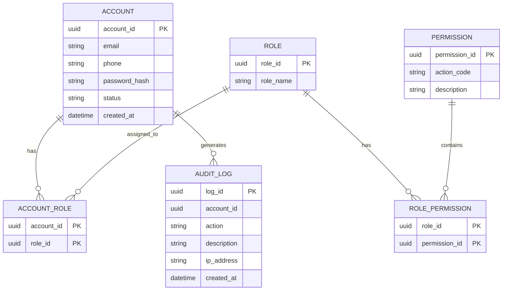

---

## X.8.2. Booking Database

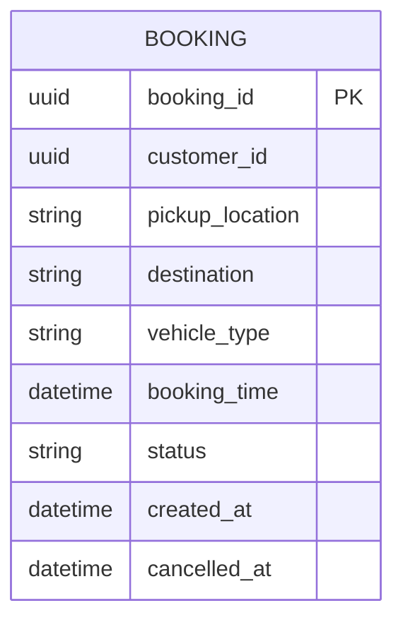

`customer_id` là Reference ID, không phải Foreign Key đến Database khác.

---

## X.8.3. Driver & Dispatch Database

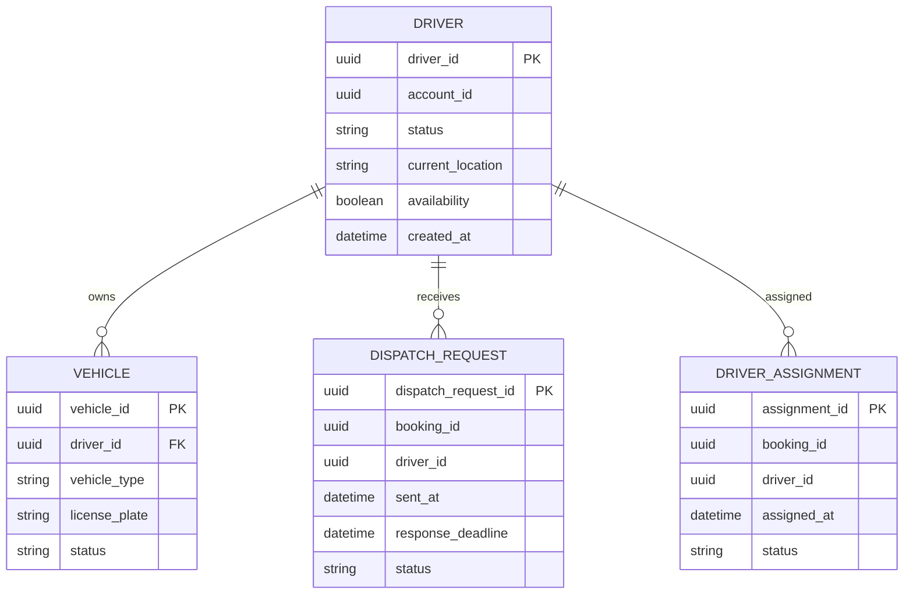

Trong Context này:

```text
Driver 1 ─── N Vehicle
Driver 1 ─── N DispatchRequest
Driver 1 ─── N DriverAssignment
```

`booking_id` là Reference ID đến Booking Service.

---

## X.8.4. Trip Database

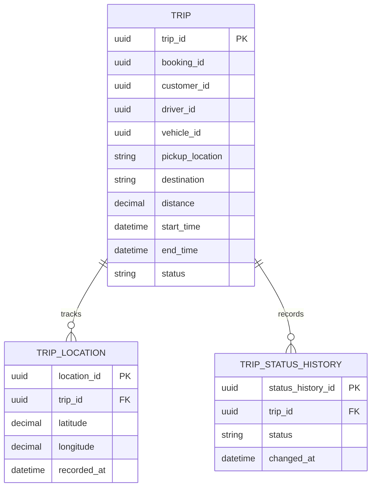

Quan hệ:

```text
TRIP
 ├── 1 : N → TRIP_LOCATION
 └── 1 : N → TRIP_STATUS_HISTORY
```

---

## X.8.5. Pricing Database

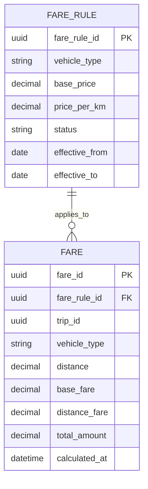

Quan hệ:

```text
FARE_RULE 1 ─── N FARE
```

`trip_id` là Reference ID đến Trip Service.

---

## X.8.6. Payment Database

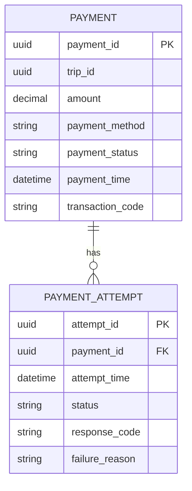

Quan hệ:

```text
PAYMENT 1 ─── N PAYMENT_ATTEMPT
```

`trip_id` là Reference ID đến Trip Service.

---

## X.8.7. Notification Database

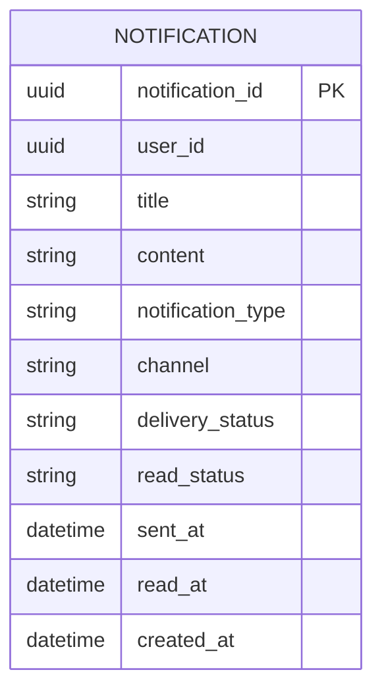

`user_id` là Reference ID đến Identity Service.

---

## X.8.8. Rating Database

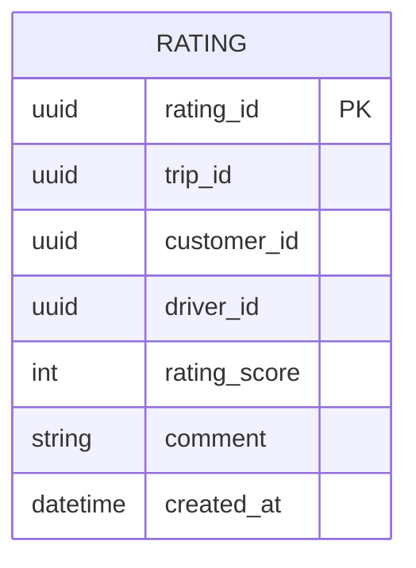

Các ID:

```text
trip_id
customer_id
driver_id
```

là Reference ID đến các Context tương ứng.

---

## X.8.9. Operations Database

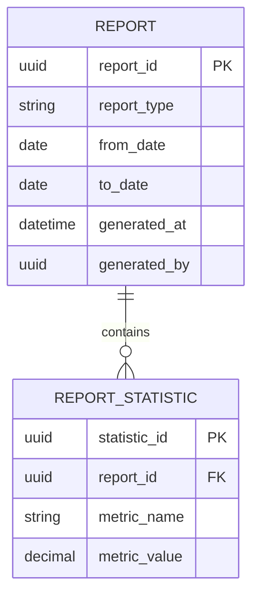

Các `CustomerView`, `DriverView`, `VehicleView` và `OperationalTripView` là dữ liệu projection phục vụ vận hành, có thể được lưu dưới dạng bảng/read model trong Operations Database.

---

# X.9. SƠ ĐỒ TỔNG THỂ KIẾN TRÚC MICROSERVICE

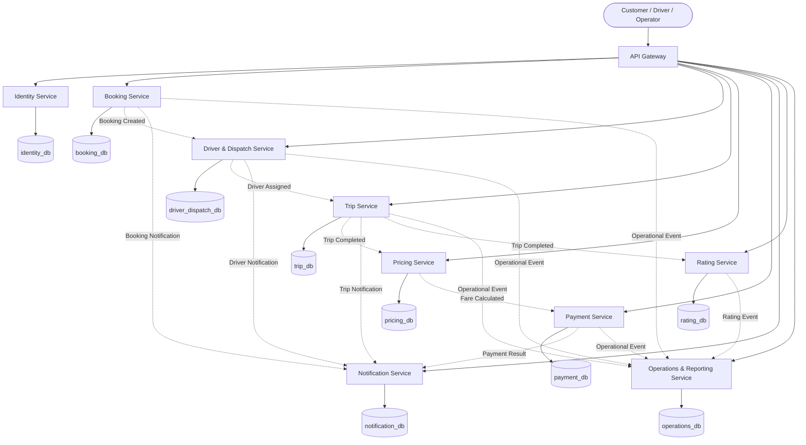

---

# X.10. BUSINESS DATA FLOW GIỮA CÁC MICROSERVICE

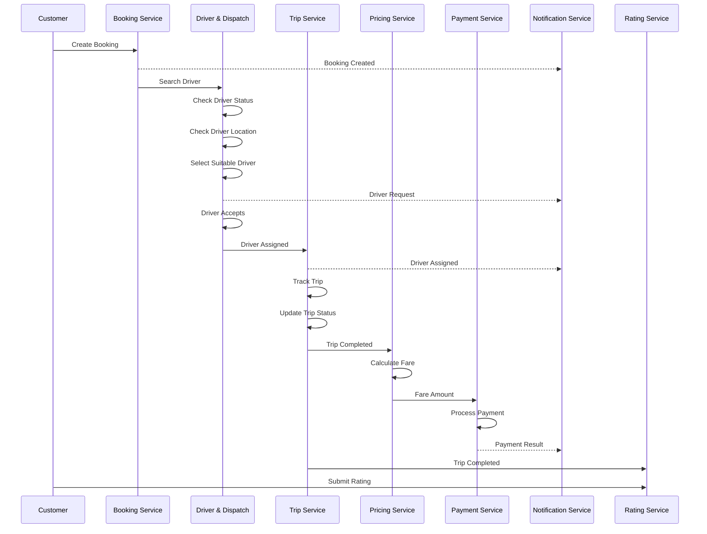

---

# X.11. QUY TẮC QUAN HỆ GIỮA CÁC MICROSERVICE

## 1. Không dùng Foreign Key xuyên Database

Không thiết kế:

```text
booking_db
    ↓
FK → identity_db
```

Thay vào đó:

```text
booking_db
    │
    └── customer_id
             │
             └── Reference ID
```

---

## 2. Microservice chỉ sở hữu dữ liệu của mình

```text
Identity Service
    ↓
Account / Role / Permission

Booking Service
    ↓
Booking

Driver & Dispatch Service
    ↓
Driver / Vehicle / Dispatch

Trip Service
    ↓
Trip / Location / Status History

Pricing Service
    ↓
Fare / Fare Rule

Payment Service
    ↓
Payment / Payment Attempt

Notification Service
    ↓
Notification

Rating Service
    ↓
Rating

Operations Service
    ↓
Operational Read Model / Report
```

---

## 3. Giao tiếp giữa các Context

Có thể sử dụng:

```text
REST API
```

cho các request cần phản hồi trực tiếp.

Hoặc:

```text
Event / Message
```

cho các sự kiện nghiệp vụ như:

```text
BookingCreated
DriverAssigned
TripStarted
TripCompleted
FareCalculated
PaymentCompleted
PaymentFailed
RatingCreated
```

---

# X.12. ÁNH XẠ FR → BOUNDED CONTEXT

| FR   | Bounded Context chịu trách nhiệm |
| ---- | -------------------------------- |
| FR01 | Identity & Access                |
| FR02 | Booking                          |
| FR03 | Driver & Dispatch                |
| FR04 | Driver & Dispatch                |
| FR05 | Trip Management                  |
| FR06 | Trip Management                  |
| FR07 | Pricing & Fare                   |
| FR08 | Payment                          |
| FR09 | Notification                     |
| FR10 | Rating & Feedback                |
| FR11 | Operations & Reporting           |
| FR12 | Operations & Reporting           |
| FR13 | Identity & Access                |
| FR14 | Trip Management + Payment        |

---

# X.13. TỔNG KẾT THIẾT KẾ

CabSystem được phân tách thành 9 Bounded Context:

1. **Identity & Access**
2. **Booking**
3. **Driver & Dispatch**
4. **Trip Management**
5. **Pricing & Fare**
6. **Payment**
7. **Notification**
8. **Rating & Feedback**
9. **Operations & Reporting**

Mỗi Bounded Context tương ứng với một Microservice và một Database riêng.

Kiến trúc tuân theo nguyên tắc:

```text
Bounded Context
      ↓
Microservice
      ↓
Own Database
      ↓
Own Domain Model
```

Các Microservice không truy cập trực tiếp Database của nhau. Những dữ liệu cần tham chiếu giữa các Context sử dụng Reference ID và giao tiếp thông qua API hoặc Event.

Chuỗi thiết kế hoàn chỉnh:

```text
Functional Requirement
        ↓
Business Workflow
        ↓
Bounded Context
        ↓
Ubiquitous Language
        ↓
Microservice
        ↓
API
        ↓
Entity Model
        ↓
Database
        ↓
Data Model
        ↓
ERD
```

Thiết kế này giúp CabSystem có khả năng phân tách rõ trách nhiệm nghiệp vụ, giảm phụ thuộc giữa các module và hỗ trợ triển khai, mở rộng từng Microservice độc lập.

---

# X.14. CẤU TRÚC ĐỀ XUẤT TRÊN GITHUB

```text
CabSystem/
│
├── API Document/
│
├── Testcase/
│
├── srs.md
│
├── Microservice_Design.md
│
└── DDD/
    │
    ├── Bounded_Context.md
    ├── Ubiquitous_Language.md
    ├── Microservice_Architecture.md
    │
    ├── Entity_Model/
    │   ├── Identity.md
    │   ├── Booking.md
    │   ├── Driver_Dispatch.md
    │   ├── Trip.md
    │   ├── Pricing.md
    │   ├── Payment.md
    │   ├── Notification.md
    │   ├── Rating.md
    │   └── Operations.md
    │
    └── ERD/
        ├── Identity.md
        ├── Booking.md
        ├── Driver_Dispatch.md
        ├── Trip.md
        ├── Pricing.md
        ├── Payment.md
        ├── Notification.md
        ├── Rating.md
        └── Operations.md
```

> **Lưu ý khi đưa lên GitHub:** Các đoạn bắt đầu bằng ` ```mermaid ` và kết thúc bằng ` ``` ` là Mermaid Diagram. GitHub sẽ tự render chúng thành sơ đồ khi mở file `.md`.

