# DDD – THIẾT KẾ BOUNDED CONTEXT VÀ MICROSERVICE CABSYSTEM

## 1. Nguyên tắc thiết kế

Hệ thống CabSystem được phân tách thành các **Bounded Context** dựa trên Functional Requirements (FR) và Business Workflow.

Mỗi Bounded Context tương ứng với một Microservice và sở hữu một Database riêng.

Quy trình thiết kế cho mỗi Bounded Context:

```text
FR liên quan
    ↓
Business Workflow
    ↓
Ubiquitous Language
    ↓
Mô hình thực thể (Entity Model)
    ↓
Bảng API
    ↓
Data Model
    ↓
Chọn Database Type
    ↓
Database
    ↓
ERD
```

Nguyên tắc:

```text
1 Bounded Context
        =
1 Microservice
        =
1 Database
```

Các Microservice không truy cập trực tiếp Database của nhau.

---

# 2. BC01 – IDENTITY & ACCESS

## 2.1. FR liên quan

| FR   | Chức năng         |
| ---- | ----------------- |
| FR01 | Quản lý tài khoản |
| FR13 | Phân quyền        |

BC01 chịu trách nhiệm đăng ký, đăng nhập, quản lý tài khoản, xác thực và phân quyền người dùng.

---

## 2.2. Business Workflow

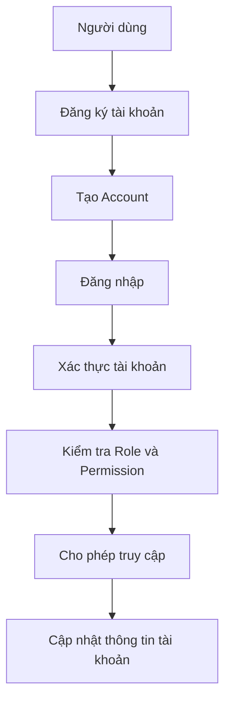

---

## 2.3. Ubiquitous Language

| Thuật ngữ      | Định nghĩa                |
| -------------- | ------------------------- |
| Account        | Tài khoản người dùng      |
| Authentication | Xác thực người dùng       |
| Authorization  | Kiểm soát quyền truy cập  |
| Role           | Vai trò của tài khoản     |
| Permission     | Quyền thực hiện chức năng |
| Audit Log      | Nhật ký thao tác          |

---

## 2.4. Mô hình thực thể

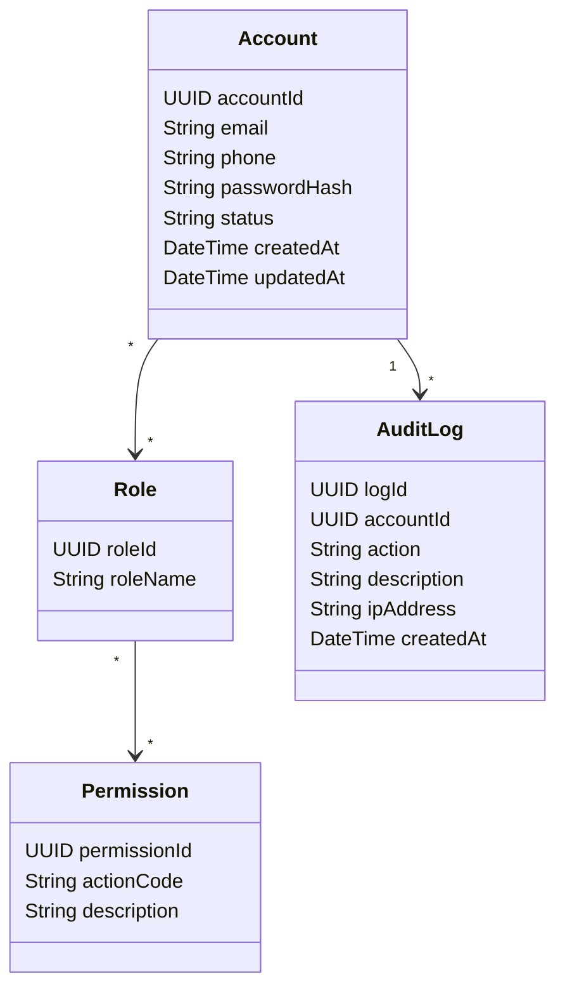

---

## 2.5. Bảng API

| API nghiệp vụ    | Entity     | Chức năng          |
| ---------------- | ---------- | ------------------ |
| Register Account | Account    | Tạo tài khoản      |
| Login            | Account    | Xác thực tài khoản |
| Get Account      | Account    | Xem thông tin      |
| Update Account   | Account    | Cập nhật thông tin |
| Assign Role      | Role       | Gán vai trò        |
| Check Permission | Permission | Kiểm tra quyền     |
| Create Audit Log | AuditLog   | Lưu nhật ký        |

> Tên HTTP Method và Endpoint cụ thể phải lấy đúng từ thư mục `API Document/` của repository.

---

## 2.6. Data Model

### ACCOUNT

| Field         | Type      | Key |
| ------------- | --------- | --- |
| account_id    | UUID      | PK  |
| email         | VARCHAR   |     |
| phone         | VARCHAR   |     |
| password_hash | VARCHAR   |     |
| status        | VARCHAR   |     |
| created_at    | TIMESTAMP |     |
| updated_at    | TIMESTAMP |     |

### ROLE

| Field     | Type    | Key |
| --------- | ------- | --- |
| role_id   | UUID    | PK  |
| role_name | VARCHAR |     |

### PERMISSION

| Field         | Type    | Key |
| ------------- | ------- | --- |
| permission_id | UUID    | PK  |
| action_code   | VARCHAR |     |
| description   | TEXT    |     |

### ACCOUNT_ROLE

| Field      | Type | Key    |
| ---------- | ---- | ------ |
| account_id | UUID | PK, FK |
| role_id    | UUID | PK, FK |

### ROLE_PERMISSION

| Field         | Type | Key    |
| ------------- | ---- | ------ |
| role_id       | UUID | PK, FK |
| permission_id | UUID | PK, FK |

### AUDIT_LOG

| Field       | Type      | Key          |
| ----------- | --------- | ------------ |
| log_id      | UUID      | PK           |
| account_id  | UUID      | Reference ID |
| action      | VARCHAR   |              |
| description | TEXT      |              |
| ip_address  | VARCHAR   |              |
| created_at  | TIMESTAMP |              |

---

## 2.7. Chọn Database Type

**PostgreSQL**

Lý do:

* Account, Role và Permission có quan hệ rõ ràng.
* Cần Transaction.
* Cần đảm bảo tính nhất quán dữ liệu.
* Có quan hệ nhiều-nhiều giữa Account, Role và Permission.

---

## 2.8. Database

```text
Microservice:
identity-service

Database:
identity_db

Database Type:
PostgreSQL

Tables:
- account
- role
- permission
- account_role
- role_permission
- audit_log
```

### ERD

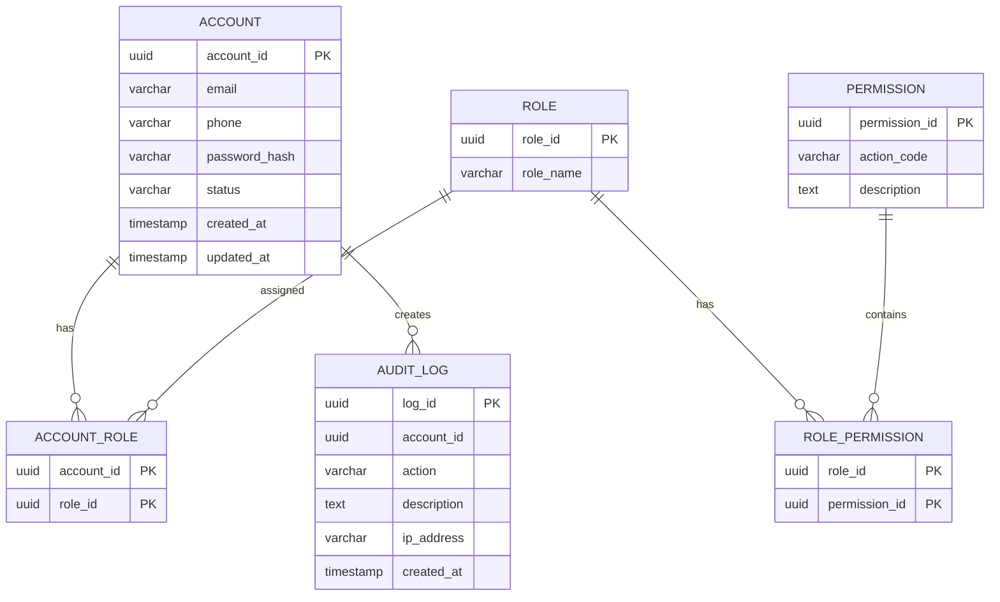

---

# 3. BC02 – BOOKING

## 3.1. FR liên quan

| FR   | Chức năng |
| ---- | --------- |
| FR02 | Đặt xe    |

BC02 chịu trách nhiệm tiếp nhận và quản lý yêu cầu đặt xe.

---

## 3.2. Business Workflow

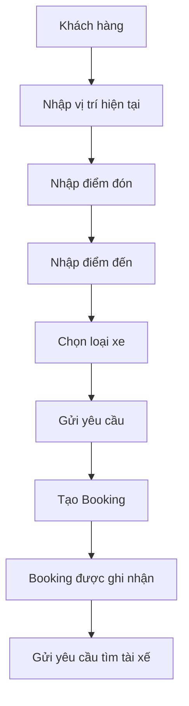

---

## 3.3. Ubiquitous Language

| Thuật ngữ       | Định nghĩa         |
| --------------- | ------------------ |
| Booking         | Yêu cầu đặt xe     |
| Pickup Location | Điểm đón           |
| Destination     | Điểm đến           |
| Vehicle Type    | Loại phương tiện   |
| Booking Status  | Trạng thái Booking |
| Cancel Booking  | Hủy yêu cầu đặt xe |

---

## 3.4. Mô hình thực thể

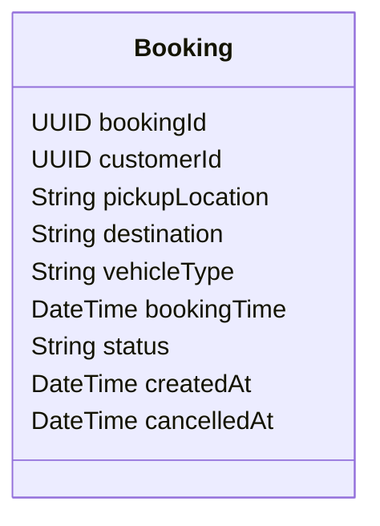

---

## 3.5. Bảng API

| API nghiệp vụ  | Entity  | Chức năng          |
| -------------- | ------- | ------------------ |
| Create Booking | Booking | Tạo yêu cầu đặt xe |
| Get Booking    | Booking | Xem Booking        |
| Cancel Booking | Booking | Hủy Booking        |
| Update Booking | Booking | Cập nhật Booking   |

---

## 3.6. Data Model

### BOOKING

| Field           | Type      | Key          |
| --------------- | --------- | ------------ |
| booking_id      | UUID      | PK           |
| customer_id     | UUID      | Reference ID |
| pickup_location | VARCHAR   |              |
| destination     | VARCHAR   |              |
| vehicle_type    | VARCHAR   |              |
| booking_time    | TIMESTAMP |              |
| status          | VARCHAR   |              |
| created_at      | TIMESTAMP |              |
| cancelled_at    | TIMESTAMP |              |

---

## 3.7. Chọn Database Type

**PostgreSQL**

Lý do:

* Booking có cấu trúc rõ ràng.
* Trạng thái Booking cần nhất quán.
* Cần Transaction khi tạo hoặc hủy Booking.

---

## 3.8. Database

```text
Microservice:
booking-service

Database:
booking_db

Database Type:
PostgreSQL

Table:
- booking
```

### ERD

Vì Database chỉ có một Entity nên sử dụng sơ đồ Entity dạng `flowchart` thay vì `erDiagram`.

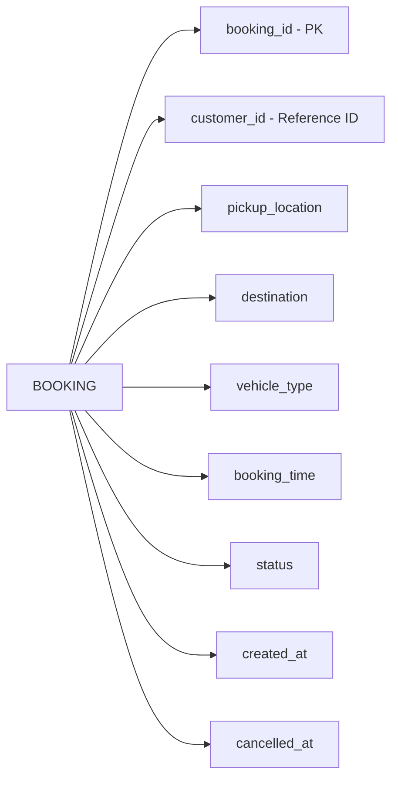

---

# 4. BC03 – DRIVER & DISPATCH

## 4.1. FR liên quan

| FR   | Chức năng        |
| ---- | ---------------- |
| FR03 | Tìm tài xế       |
| FR04 | Phân công tài xế |

---

## 4.2. Business Workflow

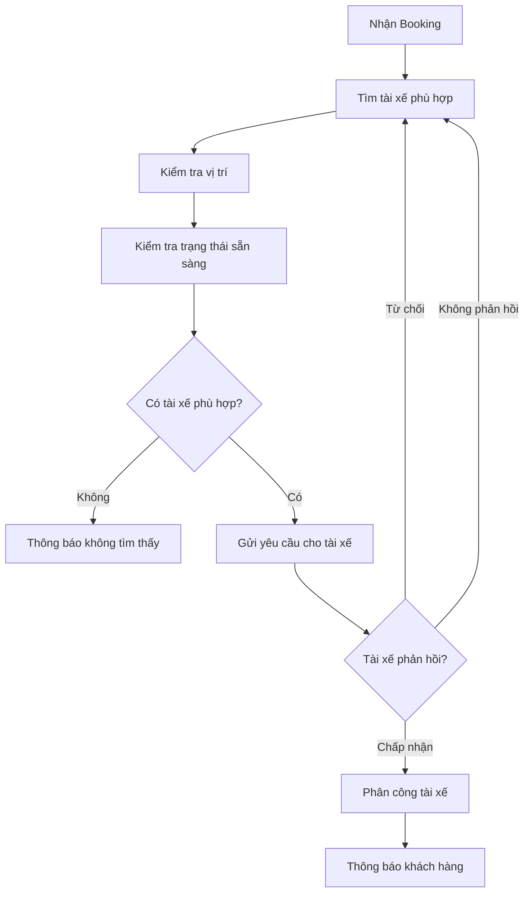

---

## 4.3. Ubiquitous Language

| Thuật ngữ        | Định nghĩa           |
| ---------------- | -------------------- |
| Driver           | Tài xế               |
| Driver Status    | Trạng thái hoạt động |
| Available Driver | Tài xế sẵn sàng      |
| Driver Location  | Vị trí tài xế        |
| Dispatch Request | Yêu cầu gửi chuyến   |
| Assignment       | Kết quả phân công    |
| Accept           | Chấp nhận            |
| Reject           | Từ chối              |

---

## 4.4. Mô hình thực thể

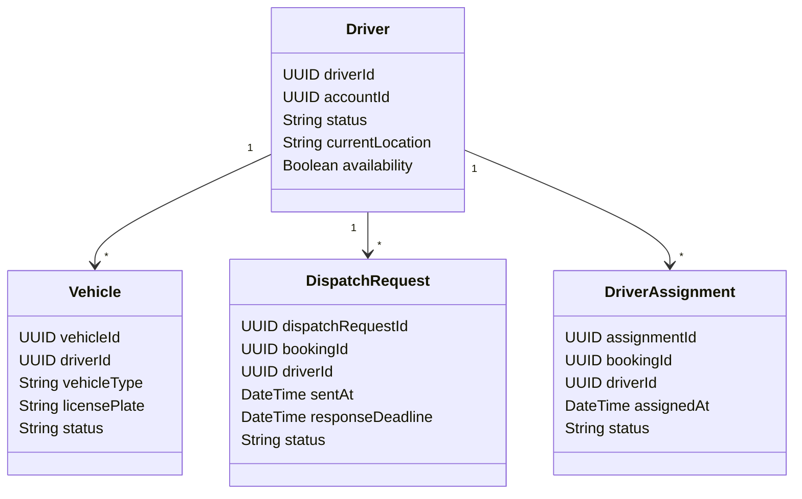

---

## 4.5. Bảng API

| API nghiệp vụ           | Entity           | Chức năng   |
| ----------------------- | ---------------- | ----------- |
| Search Available Driver | Driver           | Tìm tài xế  |
| Get Driver Location     | Driver           | Lấy vị trí  |
| Send Dispatch Request   | DispatchRequest  | Gửi yêu cầu |
| Accept Request          | DispatchRequest  | Chấp nhận   |
| Reject Request          | DispatchRequest  | Từ chối     |
| Assign Driver           | DriverAssignment | Phân công   |

---

## 4.6. Data Model

### DRIVER

| Field            | Type      | Key          |
| ---------------- | --------- | ------------ |
| driver_id        | UUID      | PK           |
| account_id       | UUID      | Reference ID |
| status           | VARCHAR   |              |
| current_location | VARCHAR   |              |
| availability     | BOOLEAN   |              |
| created_at       | TIMESTAMP |              |

### VEHICLE

| Field         | Type    | Key |
| ------------- | ------- | --- |
| vehicle_id    | UUID    | PK  |
| driver_id     | UUID    | FK  |
| vehicle_type  | VARCHAR |     |
| license_plate | VARCHAR |     |
| status        | VARCHAR |     |

### DISPATCH_REQUEST

| Field               | Type      | Key          |
| ------------------- | --------- | ------------ |
| dispatch_request_id | UUID      | PK           |
| booking_id          | UUID      | Reference ID |
| driver_id           | UUID      | FK           |
| sent_at             | TIMESTAMP |              |
| response_deadline   | TIMESTAMP |              |
| status              | VARCHAR   |              |

### DRIVER_ASSIGNMENT

| Field         | Type      | Key          |
| ------------- | --------- | ------------ |
| assignment_id | UUID      | PK           |
| booking_id    | UUID      | Reference ID |
| driver_id     | UUID      | FK           |
| assigned_at   | TIMESTAMP |              |
| status        | VARCHAR   |              |

---

## 4.7. Chọn Database Type

**PostgreSQL**

Lý do:

* Driver, Vehicle và Assignment có quan hệ.
* Cần đảm bảo trạng thái phân công nhất quán.
* Dispatch Request cần lưu trạng thái xử lý.

---

## 4.8. Database

```text
Microservice:
driver-dispatch-service

Database:
driver_dispatch_db

Database Type:
PostgreSQL

Tables:
- driver
- vehicle
- dispatch_request
- driver_assignment
```

### ERD

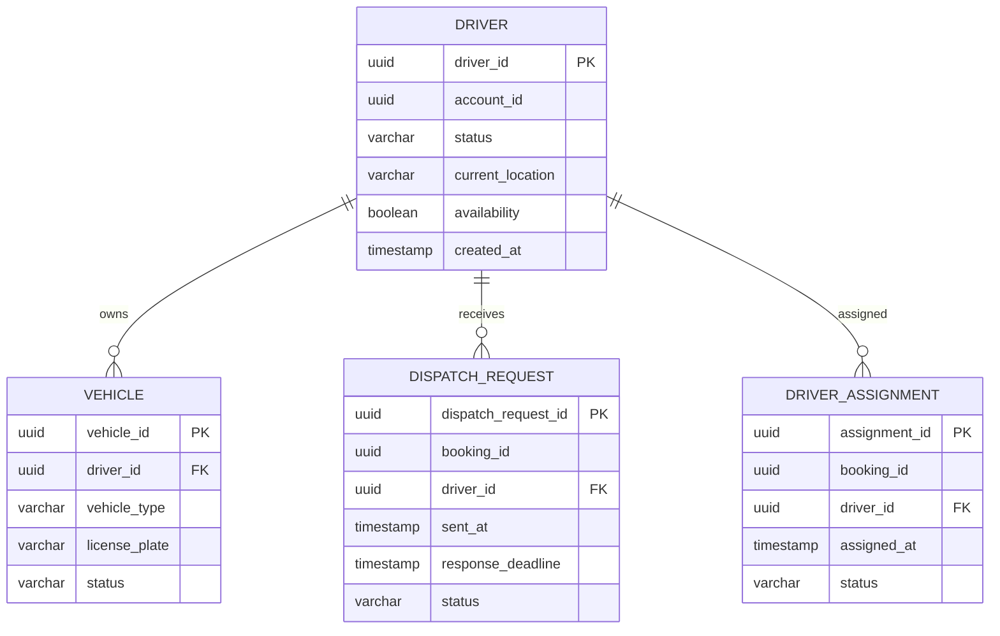

---

# 5. BC04 – TRIP MANAGEMENT

## 5.1. FR liên quan

| FR   | Chức năng         |
| ---- | ----------------- |
| FR05 | Quản lý chuyến đi |
| FR06 | Theo dõi vị trí   |
| FR14 | Lịch sử chuyến đi |

---

## 5.2. Business Workflow

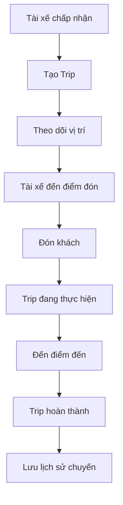

---

## 5.3. Ubiquitous Language

| Thuật ngữ     | Định nghĩa          |
| ------------- | ------------------- |
| Trip          | Chuyến xe           |
| Trip Status   | Trạng thái chuyến   |
| Trip Location | Vị trí trong chuyến |
| Picked Up     | Đã đón khách        |
| In Progress   | Đang thực hiện      |
| Completed     | Đã hoàn thành       |
| Trip History  | Lịch sử chuyến      |

---

## 5.4. Mô hình thực thể

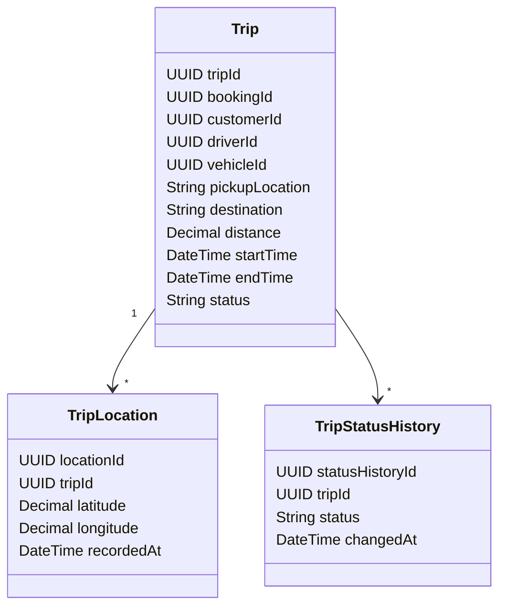

---

## 5.5. Bảng API

| API nghiệp vụ          | Entity            | Chức năng           |
| ---------------------- | ----------------- | ------------------- |
| Create Trip            | Trip              | Tạo chuyến          |
| Get Trip               | Trip              | Xem chuyến          |
| Update Trip Status     | Trip              | Cập nhật trạng thái |
| Update Driver Location | TripLocation      | Cập nhật vị trí     |
| Get Trip Location      | TripLocation      | Xem vị trí          |
| Get Trip History       | TripStatusHistory | Xem lịch sử         |

---

## 5.6. Data Model

### TRIP

| Field           | Type      | Key          |
| --------------- | --------- | ------------ |
| trip_id         | UUID      | PK           |
| booking_id      | UUID      | Reference ID |
| customer_id     | UUID      | Reference ID |
| driver_id       | UUID      | Reference ID |
| vehicle_id      | UUID      | Reference ID |
| pickup_location | VARCHAR   |              |
| destination     | VARCHAR   |              |
| distance        | DECIMAL   |              |
| start_time      | TIMESTAMP |              |
| end_time        | TIMESTAMP |              |
| status          | VARCHAR   |              |

### TRIP_LOCATION

| Field       | Type      | Key |
| ----------- | --------- | --- |
| location_id | UUID      | PK  |
| trip_id     | UUID      | FK  |
| latitude    | DECIMAL   |     |
| longitude   | DECIMAL   |     |
| recorded_at | TIMESTAMP |     |

### TRIP_STATUS_HISTORY

| Field             | Type      | Key |
| ----------------- | --------- | --- |
| status_history_id | UUID      | PK  |
| trip_id           | UUID      | FK  |
| status            | VARCHAR   |     |
| changed_at        | TIMESTAMP |     |

---

## 5.7. Chọn Database Type

**PostgreSQL**

Lý do:

* Trip có cấu trúc rõ ràng.
* Cần Transaction.
* Trip Status History cần nhất quán.
* Có quan hệ giữa Trip, Location và History.

---

## 5.8. Database

```text
Microservice:
trip-service

Database:
trip_db

Database Type:
PostgreSQL

Tables:
- trip
- trip_location
- trip_status_history
```

### ERD

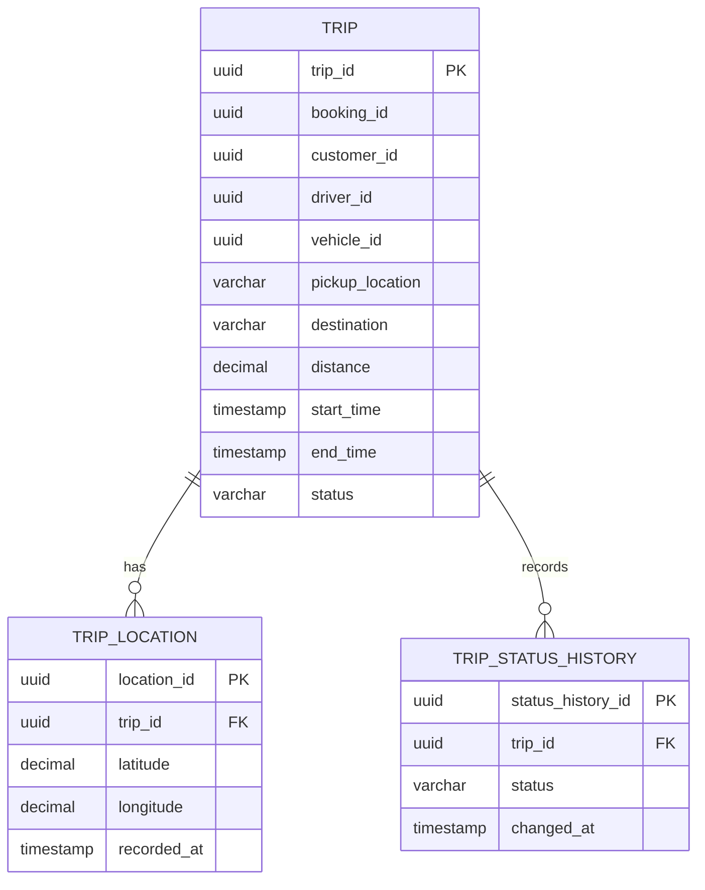

---

# 6. BC05 – PRICING & FARE

## 6.1. FR liên quan

| FR   | Chức năng |
| ---- | --------- |
| FR07 | Tính cước |

---

## 6.2. Business Workflow

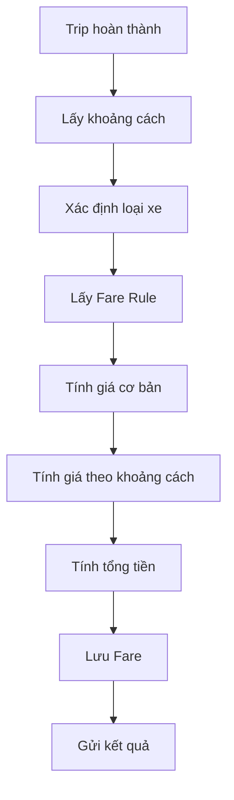

---

## 6.3. Ubiquitous Language

| Thuật ngữ    | Định nghĩa        |
| ------------ | ----------------- |
| Fare         | Tiền cước         |
| Fare Rule    | Quy tắc tính cước |
| Base Fare    | Giá cơ bản        |
| Price per Km | Giá trên mỗi km   |
| Distance     | Quãng đường       |
| Total Amount | Tổng tiền         |

---

## 6.4. Mô hình thực thể

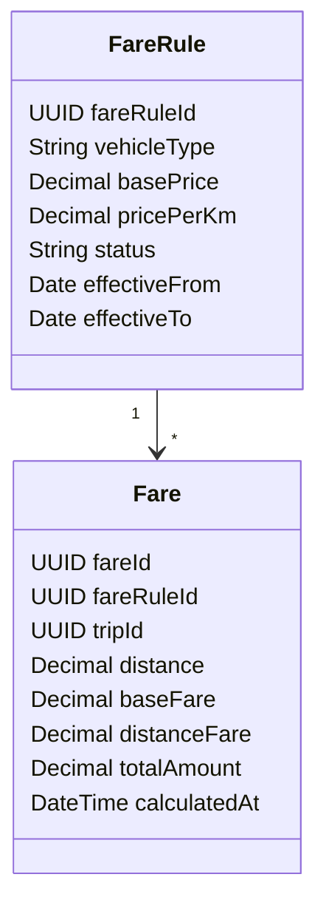

---

## 6.5. Bảng API

| API nghiệp vụ  | Entity   | Chức năng   |
| -------------- | -------- | ----------- |
| Get Fare Rule  | FareRule | Lấy quy tắc |
| Calculate Fare | Fare     | Tính cước   |
| Get Fare       | Fare     | Xem cước    |

---

## 6.6. Data Model

### FARE_RULE

| Field          | Type    | Key |
| -------------- | ------- | --- |
| fare_rule_id   | UUID    | PK  |
| vehicle_type   | VARCHAR |     |
| base_price     | DECIMAL |     |
| price_per_km   | DECIMAL |     |
| status         | VARCHAR |     |
| effective_from | DATE    |     |
| effective_to   | DATE    |     |

### FARE

| Field         | Type      | Key          |
| ------------- | --------- | ------------ |
| fare_id       | UUID      | PK           |
| fare_rule_id  | UUID      | FK           |
| trip_id       | UUID      | Reference ID |
| distance      | DECIMAL   |              |
| base_fare     | DECIMAL   |              |
| distance_fare | DECIMAL   |              |
| total_amount  | DECIMAL   |              |
| calculated_at | TIMESTAMP |              |

---

## 6.7. Chọn Database Type

**PostgreSQL**

Lý do:

* Giá tiền cần độ chính xác cao.
* Fare Rule cần quản lý hiệu lực.
* Cần tính nhất quán dữ liệu.

---

## 6.8. Database

```text
Microservice:
pricing-service

Database:
pricing_db

Database Type:
PostgreSQL

Tables:
- fare_rule
- fare
```

### ERD

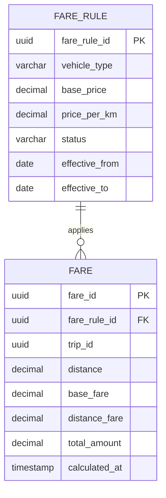

---

# 7. BC06 – PAYMENT

## 7.1. FR liên quan

| FR   | Chức năng         |
| ---- | ----------------- |
| FR08 | Thanh toán        |
| FR14 | Lịch sử giao dịch |

---

## 7.2. Business Workflow

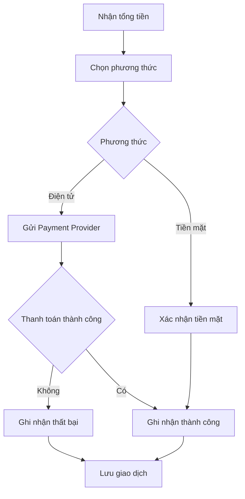

---

## 7.3. Ubiquitous Language

| Thuật ngữ       | Định nghĩa               |
| --------------- | ------------------------ |
| Payment         | Một lần thanh toán       |
| Payment Method  | Phương thức thanh toán   |
| Transaction     | Giao dịch                |
| Payment Status  | Trạng thái thanh toán    |
| Payment Attempt | Một lần thử thanh toán   |
| Payment Retry   | Thực hiện thanh toán lại |

---

## 7.4. Mô hình thực thể

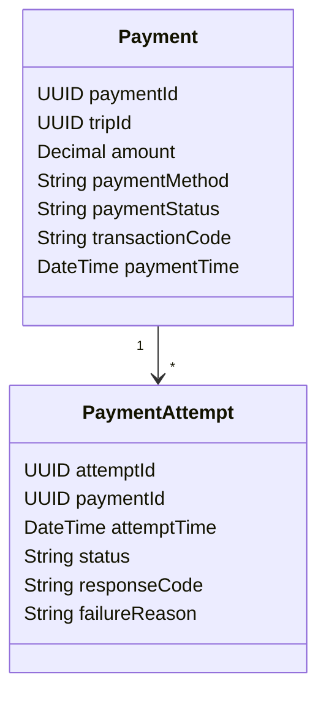

---

## 7.5. Bảng API

| API nghiệp vụ       | Entity         | Chức năng        |
| ------------------- | -------------- | ---------------- |
| Create Payment      | Payment        | Tạo thanh toán   |
| Process Payment     | Payment        | Xử lý thanh toán |
| Retry Payment       | PaymentAttempt | Thanh toán lại   |
| Get Payment         | Payment        | Xem giao dịch    |
| Get Payment History | Payment        | Xem lịch sử      |

---

## 7.6. Data Model

### PAYMENT

| Field            | Type      | Key          |
| ---------------- | --------- | ------------ |
| payment_id       | UUID      | PK           |
| trip_id          | UUID      | Reference ID |
| amount           | DECIMAL   |              |
| payment_method   | VARCHAR   |              |
| payment_status   | VARCHAR   |              |
| transaction_code | VARCHAR   |              |
| payment_time     | TIMESTAMP |              |

### PAYMENT_ATTEMPT

| Field          | Type      | Key |
| -------------- | --------- | --- |
| attempt_id     | UUID      | PK  |
| payment_id     | UUID      | FK  |
| attempt_time   | TIMESTAMP |     |
| status         | VARCHAR   |     |
| response_code  | VARCHAR   |     |
| failure_reason | TEXT      |     |

---

## 7.7. Chọn Database Type

**PostgreSQL**

Lý do:

* Payment là dữ liệu giao dịch.
* Yêu cầu tính nhất quán cao.
* Cần Transaction.
* Cần lưu lịch sử thanh toán.

---

## 7.8. Database

```text
Microservice:
payment-service

Database:
payment_db

Database Type:
PostgreSQL

Tables:
- payment
- payment_attempt
```

### ERD

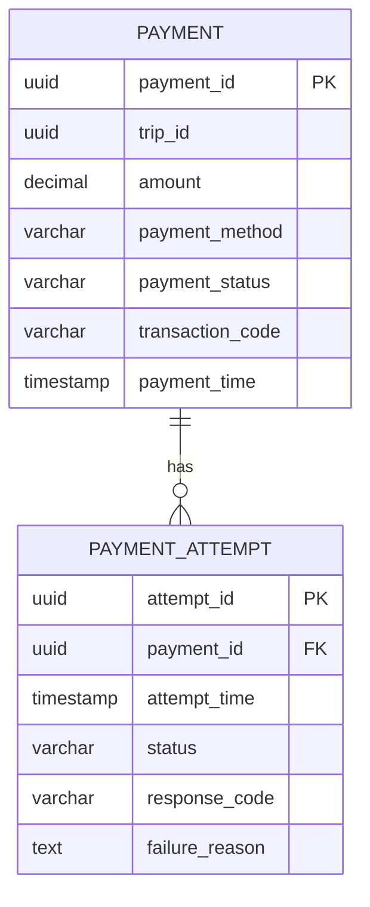

---

# 8. BC07 – NOTIFICATION

## 8.1. FR liên quan

| FR   | Chức năng |
| ---- | --------- |
| FR09 | Thông báo |

---

## 8.2. Business Workflow

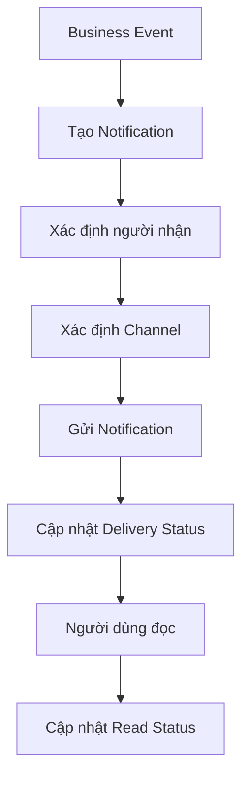

---

## 8.3. Ubiquitous Language

| Thuật ngữ         | Định nghĩa     |
| ----------------- | -------------- |
| Notification      | Thông báo      |
| Recipient         | Người nhận     |
| Channel           | Kênh gửi       |
| Delivery Status   | Trạng thái gửi |
| Read Status       | Trạng thái đọc |
| Notification Type | Loại thông báo |

---

## 8.4. Mô hình thực thể

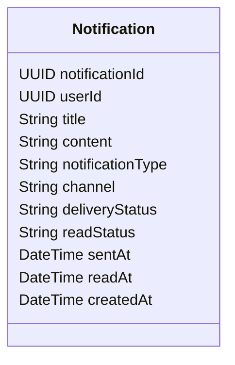

---

## 8.5. Bảng API

| API nghiệp vụ          | Entity       | Chức năng               |
| ---------------------- | ------------ | ----------------------- |
| Send Notification      | Notification | Gửi thông báo           |
| Get Notifications      | Notification | Xem thông báo           |
| Mark As Read           | Notification | Đánh dấu đã đọc         |
| Update Delivery Status | Notification | Cập nhật trạng thái gửi |

---

## 8.6. Data Model

### NOTIFICATION

| Field             | Type      | Key          |
| ----------------- | --------- | ------------ |
| notification_id   | UUID      | Primary Key  |
| user_id           | UUID      | Reference ID |
| title             | VARCHAR   |              |
| content           | TEXT      |              |
| notification_type | VARCHAR   |              |
| channel           | VARCHAR   |              |
| delivery_status   | VARCHAR   |              |
| read_status       | VARCHAR   |              |
| sent_at           | TIMESTAMP |              |
| read_at           | TIMESTAMP |              |
| created_at        | TIMESTAMP |              |

---

## 8.7. Chọn Database Type

**MongoDB**

Lý do:

* Nội dung Notification có thể linh hoạt.
* Metadata của các Channel có thể khác nhau.
* Mô hình Document phù hợp với dữ liệu thông báo.

---

## 8.8. Database

```text
Microservice:
notification-service

Database:
notification_db

Database Type:
MongoDB

Collection:
- notifications
```

### Document Model

```mermaid
flowchart LR
    N["NOTIFICATION DOCUMENT"]

    N --> A["notification_id"]
    N --> B["user_id"]
    N --> C["title"]
    N --> D["content"]
    N --> E["notification_type"]
    N --> F["channel"]
    N --> G["delivery_status"]
    N --> H["read_status"]
    N --> I["sent_at"]
    N --> J["read_at"]
    N --> K["created_at"]
```

---

# 9. BC08 – RATING & FEEDBACK

## 9.1. FR liên quan

| FR   | Chức năng       |
| ---- | --------------- |
| FR10 | Đánh giá tài xế |

---

## 9.2. Business Workflow

```mermaid
flowchart TD
    A[Trip Completed] --> B[Khách hàng mở đánh giá]
    B --> C[Chọn điểm]
    C --> D[Nhập nhận xét]
    D --> E[Gửi đánh giá]
    E --> F[Kiểm tra Trip]
    F --> G[Lưu Rating]
```

---

## 9.3. Ubiquitous Language

| Thuật ngữ    | Định nghĩa           |
| ------------ | -------------------- |
| Rating       | Đánh giá             |
| Rating Score | Điểm đánh giá        |
| Feedback     | Phản hồi             |
| Comment      | Nhận xét             |
| Rated Driver | Tài xế được đánh giá |

---

## 9.4. Mô hình thực thể

```mermaid
classDiagram
    class Rating {
        UUID ratingId
        UUID tripId
        UUID customerId
        UUID driverId
        Integer ratingScore
        String comment
        DateTime createdAt
    }
```

---

## 9.5. Bảng API

| API nghiệp vụ      | Entity | Chức năng           |
| ------------------ | ------ | ------------------- |
| Create Rating      | Rating | Tạo đánh giá        |
| Get Rating         | Rating | Xem đánh giá        |
| Get Driver Ratings | Rating | Xem đánh giá tài xế |

---

## 9.6. Data Model

### RATING

| Field        | Type      | Key          |
| ------------ | --------- | ------------ |
| rating_id    | UUID      | PK           |
| trip_id      | UUID      | Reference ID |
| customer_id  | UUID      | Reference ID |
| driver_id    | UUID      | Reference ID |
| rating_score | INTEGER   |              |
| comment      | TEXT      |              |
| created_at   | TIMESTAMP |              |

### Constraint

```text
UNIQUE(trip_id)
```

Mỗi chuyến chỉ được tạo một Rating.

---

## 9.7. Chọn Database Type

**PostgreSQL**

Lý do:

* Rating có cấu trúc rõ ràng.
* Cần ràng buộc dữ liệu.
* Có thể truy vấn và thống kê điểm đánh giá.

---

## 9.8. Database

```text
Microservice:
rating-service

Database:
rating_db

Database Type:
PostgreSQL

Table:
- rating
```

### ERD

Database chỉ có một Entity nên sử dụng `flowchart`, tránh lỗi `erDiagram` của GitHub.

```mermaid
flowchart LR
    R["RATING"]

    R --> A["rating_id - PK"]
    R --> B["trip_id - Reference ID"]
    R --> C["customer_id - Reference ID"]
    R --> D["driver_id - Reference ID"]
    R --> E["rating_score"]
    R --> F["comment"]
    R --> G["created_at"]
```

---

# 10. BC09 – OPERATIONS & REPORTING

## 10.1. FR liên quan

| FR   | Chức năng        |
| ---- | ---------------- |
| FR11 | Quản lý vận hành |
| FR12 | Báo cáo          |

---

## 10.2. Business Workflow

```mermaid
flowchart TD
    A[Dữ liệu từ các Microservice] --> B[Thu thập Operational Data]
    B --> C[Quản lý khách hàng]
    B --> D[Quản lý tài xế]
    B --> E[Quản lý phương tiện]
    B --> F[Theo dõi chuyến]
    C --> G[Tạo báo cáo]
    D --> G
    E --> G
    F --> G
    G --> H[Thống kê]
    H --> I[Hiển thị báo cáo]
```

---

## 10.3. Ubiquitous Language

| Thuật ngữ          | Định nghĩa                           |
| ------------------ | ------------------------------------ |
| Operation          | Hoạt động vận hành                   |
| Customer View      | Dữ liệu khách hàng phục vụ vận hành  |
| Driver View        | Dữ liệu tài xế phục vụ vận hành      |
| Vehicle View       | Dữ liệu phương tiện phục vụ vận hành |
| Operational Trip   | Dữ liệu chuyến phục vụ giám sát      |
| Report             | Báo cáo                              |
| Statistic          | Chỉ số thống kê                      |
| Driver Performance | Hiệu quả tài xế                      |
| Cancellation Rate  | Tỷ lệ hủy                            |

---

## 10.4. Mô hình thực thể

```mermaid
classDiagram
    class CustomerView {
        UUID customerId
        UUID accountId
        String customerName
        String phone
        String status
    }

    class DriverView {
        UUID driverId
        String driverName
        String status
        Boolean availability
    }

    class VehicleView {
        UUID vehicleId
        UUID driverId
        String vehicleType
        String licensePlate
        String status
    }

    class OperationalTripView {
        UUID tripId
        UUID customerId
        UUID driverId
        UUID vehicleId
        String status
        DateTime startTime
        DateTime endTime
    }

    class Report {
        UUID reportId
        String reportType
        Date fromDate
        Date toDate
        DateTime generatedAt
        UUID generatedBy
    }

    class ReportStatistic {
        UUID statisticId
        UUID reportId
        String metricName
        Decimal metricValue
    }

    Report "1" --> "*" ReportStatistic
    DriverView "1" --> "*" VehicleView
```

---

## 10.5. Bảng API

| API nghiệp vụ            | Entity              | Chức năng           |
| ------------------------ | ------------------- | ------------------- |
| Get Customer Information | CustomerView        | Quản lý khách hàng  |
| Get Driver Information   | DriverView          | Quản lý tài xế      |
| Get Vehicle Information  | VehicleView         | Quản lý phương tiện |
| Get Operational Trip     | OperationalTripView | Theo dõi chuyến     |
| Generate Report          | Report              | Tạo báo cáo         |
| Get Report               | Report              | Xem báo cáo         |
| Get Statistics           | ReportStatistic     | Xem thống kê        |

---

## 10.6. Data Model

### CUSTOMER_VIEW

| Field         | Type    | Key          |
| ------------- | ------- | ------------ |
| customer_id   | UUID    | PK           |
| account_id    | UUID    | Reference ID |
| customer_name | VARCHAR |              |
| phone         | VARCHAR |              |
| status        | VARCHAR |              |

### DRIVER_VIEW

| Field        | Type    | Key |
| ------------ | ------- | --- |
| driver_id    | UUID    | PK  |
| driver_name  | VARCHAR |     |
| status       | VARCHAR |     |
| availability | BOOLEAN |     |

### VEHICLE_VIEW

| Field         | Type    | Key          |
| ------------- | ------- | ------------ |
| vehicle_id    | UUID    | PK           |
| driver_id     | UUID    | Reference ID |
| vehicle_type  | VARCHAR |              |
| license_plate | VARCHAR |              |
| status        | VARCHAR |              |

### OPERATIONAL_TRIP_VIEW

| Field       | Type      | Key          |
| ----------- | --------- | ------------ |
| trip_id     | UUID      | PK           |
| customer_id | UUID      | Reference ID |
| driver_id   | UUID      | Reference ID |
| vehicle_id  | UUID      | Reference ID |
| status      | VARCHAR   |              |
| start_time  | TIMESTAMP |              |
| end_time    | TIMESTAMP |              |

### REPORT

| Field        | Type      | Key          |
| ------------ | --------- | ------------ |
| report_id    | UUID      | PK           |
| report_type  | VARCHAR   |              |
| from_date    | DATE      |              |
| to_date      | DATE      |              |
| generated_at | TIMESTAMP |              |
| generated_by | UUID      | Reference ID |

### REPORT_STATISTIC

| Field        | Type    | Key |
| ------------ | ------- | --- |
| statistic_id | UUID    | PK  |
| report_id    | UUID    | FK  |
| metric_name  | VARCHAR |     |
| metric_value | DECIMAL |     |

---

## 10.7. Chọn Database Type

**PostgreSQL**

Lý do:

* Dữ liệu vận hành có cấu trúc.
* Báo cáo cần truy vấn tổng hợp.
* Report và ReportStatistic có quan hệ.
* Phù hợp với các truy vấn thống kê.

---

## 10.8. Database

```text
Microservice:
operations-service

Database:
operations_db

Database Type:
PostgreSQL

Tables:
- customer_view
- driver_view
- vehicle_view
- operational_trip_view
- report
- report_statistic
```

### ERD

```mermaid
erDiagram
    REPORT ||--o{ REPORT_STATISTIC : contains

    REPORT {
        uuid report_id PK
        varchar report_type
        date from_date
        date to_date
        timestamp generated_at
        uuid generated_by
    }

    REPORT_STATISTIC {
        uuid statistic_id PK
        uuid report_id FK
        varchar metric_name
        decimal metric_value
    }
```

Các View còn lại là các bảng dữ liệu vận hành độc lập:

```mermaid
flowchart LR
    A["CUSTOMER_VIEW"]
    B["DRIVER_VIEW"]
    C["VEHICLE_VIEW"]
    D["OPERATIONAL_TRIP_VIEW"]

    B --> C
```

---

# 11. TỔNG HỢP 9 BOUNDED CONTEXT

| BC   | FR               | Microservice            | Database           | Database Type |
| ---- | ---------------- | ----------------------- | ------------------ | ------------- |
| BC01 | FR01, FR13       | identity-service        | identity_db        | PostgreSQL    |
| BC02 | FR02             | booking-service         | booking_db         | PostgreSQL    |
| BC03 | FR03, FR04       | driver-dispatch-service | driver_dispatch_db | PostgreSQL    |
| BC04 | FR05, FR06, FR14 | trip-service            | trip_db            | PostgreSQL    |
| BC05 | FR07             | pricing-service         | pricing_db         | PostgreSQL    |
| BC06 | FR08, FR14       | payment-service         | payment_db         | PostgreSQL    |
| BC07 | FR09             | notification-service    | notification_db    | MongoDB       |
| BC08 | FR10             | rating-service          | rating_db          | PostgreSQL    |
| BC09 | FR11, FR12       | operations-service      | operations_db      | PostgreSQL    |

---

# 12. TỔNG QUAN KIẾN TRÚC

```mermaid
flowchart TB
    USER["Customer / Driver / Operator"]

    USER --> GATEWAY["API Gateway"]

    GATEWAY --> ID["Identity Service"]
    GATEWAY --> BOOK["Booking Service"]
    GATEWAY --> DIS["Driver & Dispatch Service"]
    GATEWAY --> TRIP["Trip Service"]
    GATEWAY --> PRICE["Pricing Service"]
    GATEWAY --> PAY["Payment Service"]
    GATEWAY --> NOTI["Notification Service"]
    GATEWAY --> RATE["Rating Service"]
    GATEWAY --> OPS["Operations Service"]

    ID --> IDDB[("identity_db")]
    BOOK --> BOOKDB[("booking_db")]
    DIS --> DISDB[("driver_dispatch_db")]
    TRIP --> TRIPDB[("trip_db")]
    PRICE --> PRICEDB[("pricing_db")]
    PAY --> PAYDB[("payment_db")]
    NOTI --> NOTIDB[("notification_db")]
    RATE --> RATEDB[("rating_db")]
    OPS --> OPSDB[("operations_db")]

    BOOK -.-> DIS
    DIS -.-> TRIP
    TRIP -.-> PRICE
    PRICE -.-> PAY

    BOOK -.-> NOTI
    DIS -.-> NOTI
    TRIP -.-> NOTI
    PAY -.-> NOTI

    TRIP -.-> RATE

    BOOK -.-> OPS
    DIS -.-> OPS
    TRIP -.-> OPS
    PAY -.-> OPS
    RATE -.-> OPS
```

---

# 13. DATA OWNERSHIP

Mỗi Microservice sở hữu dữ liệu của chính mình.

```text
Identity Service
    ↓
Account / Role / Permission

Booking Service
    ↓
Booking

Driver & Dispatch Service
    ↓
Driver / Vehicle / Dispatch

Trip Service
    ↓
Trip / Location / Trip History

Pricing Service
    ↓
Fare / Fare Rule

Payment Service
    ↓
Payment / Payment Attempt

Notification Service
    ↓
Notification

Rating Service
    ↓
Rating

Operations Service
    ↓
Operational Data / Report
```

Không cho phép:

```text
Service A
    ↓
truy cập trực tiếp
    ↓
Database B
```

Thay vào đó:

```text
Service A
    ↓
API / Event
    ↓
Service B
    ↓
Database B
```

---

# 14. FR → BOUNDED CONTEXT → MICROSERVICE

| FR   | Bounded Context           | Microservice                   |
| ---- | ------------------------- | ------------------------------ |
| FR01 | Identity & Access         | identity-service               |
| FR02 | Booking                   | booking-service                |
| FR03 | Driver & Dispatch         | driver-dispatch-service        |
| FR04 | Driver & Dispatch         | driver-dispatch-service        |
| FR05 | Trip Management           | trip-service                   |
| FR06 | Trip Management           | trip-service                   |
| FR07 | Pricing & Fare            | pricing-service                |
| FR08 | Payment                   | payment-service                |
| FR09 | Notification              | notification-service           |
| FR10 | Rating & Feedback         | rating-service                 |
| FR11 | Operations & Reporting    | operations-service             |
| FR12 | Operations & Reporting    | operations-service             |
| FR13 | Identity & Access         | identity-service               |
| FR14 | Trip Management + Payment | trip-service + payment-service |

---

# 15. KẾT LUẬN

Thiết kế DDD của CabSystem gồm 9 Bounded Context:

```text
BC01 – Identity & Access
BC02 – Booking
BC03 – Driver & Dispatch
BC04 – Trip Management
BC05 – Pricing & Fare
BC06 – Payment
BC07 – Notification
BC08 – Rating & Feedback
BC09 – Operations & Reporting
```

Mỗi Bounded Context được thiết kế theo cùng một trình tự:

```text
FR liên quan
      ↓
Business Workflow
      ↓
Ubiquitous Language
      ↓
Mô hình thực thể
      ↓
API
      ↓
Data Model
      ↓
Chọn Database Type
      ↓
Database
      ↓
ERD
```

Kiến trúc cuối cùng:

```text
9 Bounded Context
        ↓
9 Microservice
        ↓
9 Database
```

Mỗi Microservice sở hữu dữ liệu riêng và giao tiếp với Microservice khác thông qua API hoặc Event/Message.
