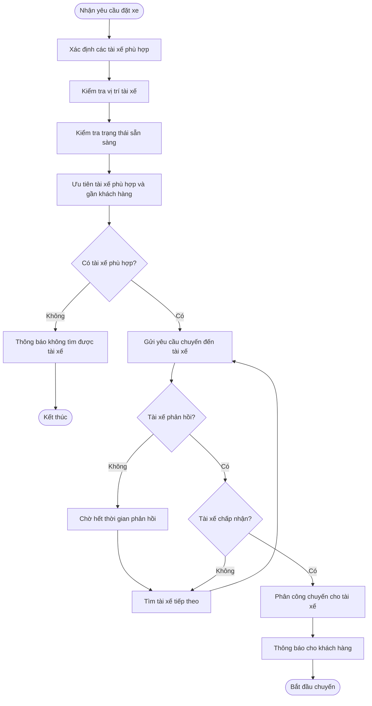
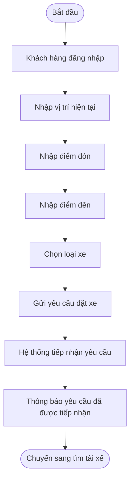
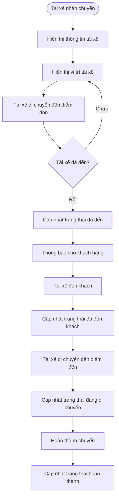
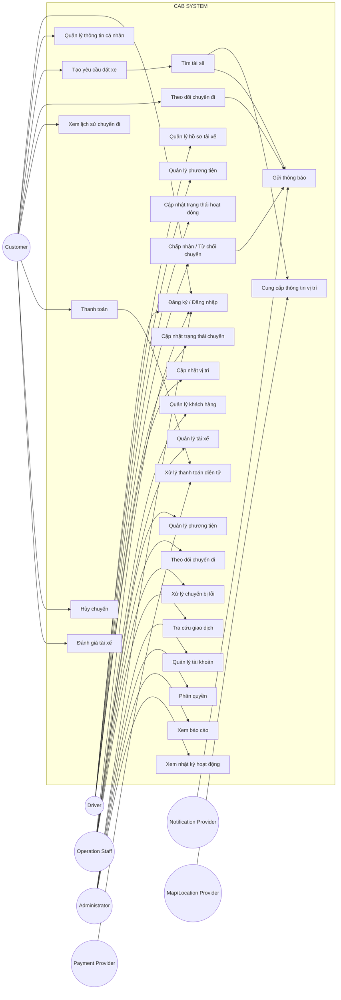
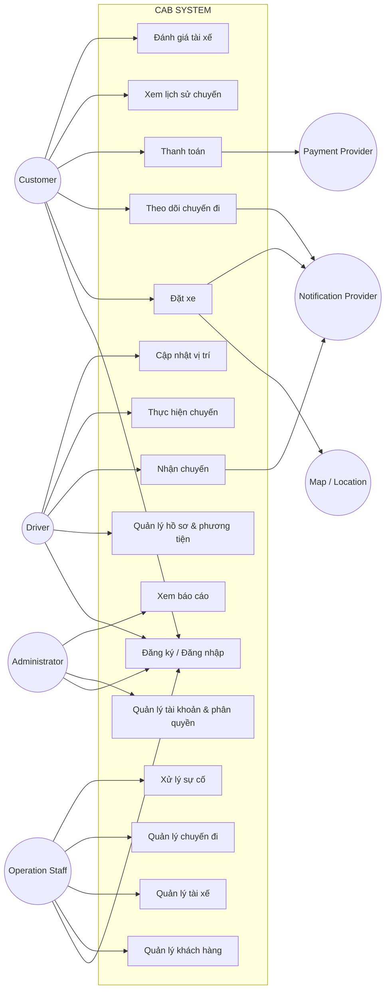

# B1: Business Context (Ngữ cảnh nghiệp vụ) và Business Problem

### Khách hàng muốn giải quyết vấn đề gì?
- Tự động hóa việc đặt xe, tìm tài xế, theo dõi chuyến đi và quản lý thanh toán.

### Vì sao hệ thống hiện tại không thể đáp ứng?
- Phân công tài xế còn thủ công, dữ liệu thanh toán chưa tập trung, khó theo dõi chuyến và khó mở rộng khi số lượng người dùng tăng.

### Mục tiêu kinh doanh của CAB System
- Tự động hóa quy trình đặt xe và phân công tài xế.
- Nâng cao trải nghiệm khách hàng.
- Tăng hiệu quả vận hành, giảm thao tác thủ công.
- Quản lý tập trung chuyến đi, thanh toán và dữ liệu.
- Tăng khả năng mở rộng khi số lượng khách hàng và tài xế tăng.

### Ai sẽ sử dụng hệ thống này?
- Khách hàng (Customer).
- Tài xế (Driver).
- Nhân viên vận hành (Operator).
- Ban lãnh đạo (Management) để xem báo cáo.

### Giá trị hệ thống tạo ra so với hệ thống cũ
- Tự động hơn.
- Quản lý tập trung hơn.
- Theo dõi chuyến đi tốt hơn.
- Giảm chi phí và thao tác vận hành.
- Dễ mở rộng trong tương lai.

# B2: 
## 1. Xác định stakeholder

| Stakeholder                                        | Vai trò                                                            |
| -------------------------------------------------- | ------------------------------------------------------------------ |
| **Khách hàng (Customer)**                          | Đặt xe, theo dõi chuyến đi, thanh toán và đánh giá tài xế.         |
| **Tài xế (Driver)**                                | Nhận chuyến, thực hiện chuyến và cập nhật trạng thái.              |
| **Nhân viên vận hành (Operator)**                  | Quản lý khách hàng, tài xế, phương tiện, chuyến đi và xử lý sự cố. |
| **Ban lãnh đạo (Management)**                      | Theo dõi báo cáo, doanh thu và hiệu quả hoạt động.                 |
| **Nhà cung cấp thanh toán (Payment Provider)**     | Xử lý các giao dịch thanh toán điện tử.                            |
| **Nhà cung cấp thông báo (Notification Provider)** | Cung cấp dịch vụ gửi thông báo cho khách hàng và tài xế.           |
| **Business Analyst (BA)**                          | Phân tích nghiệp vụ, thu thập và làm rõ yêu cầu.                   |
| **Đội phát triển (Development Team)**              | Thiết kế, xây dựng và triển khai hệ thống CAB.                     |


##2: Vẽ Ma trận stakeholder để cho bt mức độ ảnh hưởng của các vai trò
 ## 3. Stakeholder Matrix

**Ma trận Stakeholder theo mức độ ảnh hưởng (Power) và mức độ quan tâm (Interest):**
### MA TRẬN STAKEHOLDER – POWER / INTEREST

|                         | **MỨC ĐỘ QUAN TÂM THẤP** | **MỨC ĐỘ QUAN TÂM CAO** |
|-------------------------|---------------------------|---------------------------|
| **ẢNH HƯỞNG CAO**       | 🟡 **KEEP SATISFIED**     | 🔴 **MANAGE CLOSELY**     |
|                         | • Nhà cung cấp thanh toán | • Ban lãnh đạo            |
|                         | • Nhà cung cấp thông báo  | • Nhân viên vận hành      |
| **ẢNH HƯỞNG THẤP**      | ⚪ **MONITOR**             | 🟢 **KEEP INFORMED**      |
|                         | • BA / Đội phát triển     | • Khách hàng               |
|                         |                           | • Tài xế                   |

### Chiến lược quản lý
- 🔴 **Manage Closely:** Thường xuyên trao đổi và tham gia quyết định.
- 🟡 **Keep Satisfied:** Đảm bảo nhu cầu và duy trì sự hài lòng.
- 🟢 **Keep Informed:** Cập nhật thông tin thường xuyên.
- ⚪ **Monitor:** Theo dõi và cập nhật khi cần.

### Sơ đồ Stakeholder Matrix
```text
                    MỨC ĐỘ ẢNH HƯỞNG (POWER)
                              CAO
                               │
        KEEP SATISFIED        │        MANAGE CLOSELY
                               │
  • Nhà cung cấp thanh toán    │  • Ban lãnh đạo
  • Nhà cung cấp thông báo    │  • Nhân viên vận hành
                               │
───────────────────────────────┼────────────────────────
                               │
        MONITOR               │        KEEP INFORMED
                               │
  • BA / Đội phát triển        │  • Khách hàng
                               │  • Tài xế
                               │
                              THẤP
                         MỨC ĐỘ QUAN TÂM
                           THẤP  →  CAO
```

# B3: BUSINESS GOALS
1. BJ01 – Tăng tính linh hoạt và thuận tiện trong thanh toán:
* Hỗ trợ thanh toán bằng tiền mặt.
* Hỗ trợ thanh toán online/chuyển khoản.
--
2. BJ02 – Giảm thời gian chờ xe của khách hàng:
* Tìm tài xế tự động.
* Ưu tiên tài xế phù hợp và gần khách hàng.
---
3.  BJ03 – Nâng cao trải nghiệm đặt xe của khách hàng:
* Dễ dàng tạo yêu cầu đặt xe.
* Biết được trạng thái của yêu cầu đặt xe.
* Biết thông tin tài xế khi chuyến xe được xác nhận.
* Theo dõi được tình trạng chuyến đi.
---
4. BJ04 – Nâng cao hiệu quả quản lý và vận hành:
* Theo dõi được các chuyến xe đang diễn ra.
* Nắm được tình trạng hoạt động của tài xế.
* Hỗ trợ xử lý các trường hợp chuyến xe gặp vấn đề.
* Tra cứu được thông tin các giao dịch và chuyến đi.
---
5. BJ05 – Nâng cao hiệu quả hoạt động của tài xế
* Nắm được trạng thái hoạt động của tài xế.
* Phân công chuyến xe cho tài xế phù hợp.
* Ưu tiên tài xế có vị trí thuận lợi cho khách hàng.
* Hạn chế thời gian tài xế phải chờ nhận chuyến.
---
6. BJ06 – Nâng cao khả năng theo dõi và minh bạch thông tin chuyến đi
* Biết tài xế nào đang thực hiện chuyến.
* Biết thời gian dự kiến tài xế đến.
* Biết trạng thái hiện tại của chuyến xe.
* Tra cứu được lịch sử chuyến đi.
---
7. BJ07 – Nâng cao độ tin cậy của dịch vụ đặt xe
* Không làm gián đoạn toàn bộ dịch vụ khi thanh toán gặp lỗi.
* Không làm gián đoạn toàn bộ dịch vụ khi thông báo gặp lỗi.
* Có phương án xử lý khi không tìm được tài xế.
* Có phương án xử lý khi tài xế không phản hồi hoặc từ chối chuyến.
---
8. BJ08 – Nâng cao chất lượng thanh toán
* Hỗ trợ nhiều phương thức thanh toán.
* Thông báo rõ kết quả thanh toán.
* Có khả năng xử lý lại khi thanh toán điện tử thất bại.
* Bảo vệ thông tin thanh toán nhạy cảm của khách hàng.
---
9. BJ09 – Nâng cao chất lượng dịch vụ thông qua phản hồi khách hàng
* Đánh giá tài xế sau khi hoàn thành chuyến.
* Ghi nhận kết quả đánh giá của khách hàng.
* Sử dụng thông tin đánh giá để theo dõi chất lượng tài xế.
---
10. BJ10 – Nâng cao khả năng mở rộng của hệ thống
* Hệ thống có thể phục vụ số lượng lớn khách hàng và tài xế.
* Có thể mở rộng từng thành phần khi nhu cầu tăng.
* Có thể bổ sung các dịch vụ mới trong tương lai.
---

11. BJ11 – Tăng khả năng phát triển và thay đổi hệ thống
* Có thể thêm phương thức thanh toán mới.
* Có thể thêm nhà cung cấp thông báo mới.
* Có thể bổ sung các loại dịch vụ mới.
* Có thể thay đổi một số thành phần kỹ thuật khi cần thiết.
---
12. BJ12 – Nâng cao khả năng kiểm soát và bảo mật thông tin
* Bảo vệ thông tin cá nhân của khách hàng và tài xế.
* Bảo vệ dữ liệu vị trí.
* Bảo vệ dữ liệu giao dịch.
* Kiểm soát quyền truy cập của nhân viên.
* Lưu lại các thao tác quan trọng để phục vụ kiểm tra.


# B4: Xác định PHẠM VI SCOPE: 
1. Quản lý tài khoản người dùng
- Đăng ký và đăng nhập tài khoản khách hàng.
- Quản lý thông tin cá nhân khách hàng.
- Quản lý tài khoản và hồ sơ tài xế.
- Quản lý quyền truy cập của nhân viên vận hành và quản trị viên.
2. Quản lý tài xế và phương tiện
- Quản lý thông tin tài xế.
- Quản lý thông tin phương tiện.
- Theo dõi trạng thái hoạt động của tài xế.
- Theo dõi vị trí của tài xế.
- Quản lý khả năng nhận chuyến của tài xế.
3. Đặt xe và phân công tài xế
- Nhập điểm đón và điểm đến.
- Lựa chọn loại xe.
- Tiếp nhận yêu cầu đặt xe.
- Tìm kiếm tài xế phù hợp.
- Ưu tiên tài xế dựa trên vị trí, trạng thái và tiêu chí vận hành.
- Tiếp tục tìm tài xế khác khi tài xế từ chối hoặc không phản hồi.
- Thông báo khi không tìm được tài xế.
4. Quản lý chuyến đi
- Theo dõi trạng thái chuyến đi.
- Cập nhật trạng thái chuyến.
- Theo dõi thời gian dự kiến tài xế đến.
- Quản lý quá trình thực hiện chuyến.
- Xử lý các trường hợp chuyến bị hủy hoặc gặp sự cố.
- Lưu lịch sử chuyến đi.
5. Tính cước và thanh toán
- Xác định số tiền khách hàng phải trả.
- Hỗ trợ thanh toán bằng tiền mặt.
- Hỗ trợ thanh toán điện tử/chuyển khoản.
- Tích hợp với nhà cung cấp thanh toán bên ngoài.
- Xử lý kết quả thanh toán.
- Xử lý trường hợp thanh toán thất bại.
- Lưu lịch sử giao dịch.
- Không lưu trực tiếp thông tin nhạy cảm của thẻ hoặc tài khoản thanh toán.
6. Thông báo
- Thông báo cho khách hàng về trạng thái đặt xe.
- Thông báo khi tài xế nhận chuyến.
- Thông báo khi tài xế đến điểm đón.
- Thông báo khi chuyến hoàn thành.
- Thông báo kết quả thanh toán.
- Thông báo cho tài xế về chuyến mới và các thay đổi liên quan đến chuyến đi.
- Hỗ trợ mở rộng thêm các kênh thông báo trong tương lai.
7. Đánh giá và phản hồi
- Khách hàng đánh giá tài xế sau khi hoàn thành chuyến.
- Lưu thông tin đánh giá.
- Theo dõi chất lượng phục vụ của tài xế.
8. Quản trị và vận hành
- Quản lý khách hàng.
- Quản lý tài xế.
- Quản lý phương tiện.
- Theo dõi các chuyến đang diễn ra.
- Kiểm tra trạng thái tài xế.
- Hỗ trợ xử lý các chuyến bị lỗi.
- Tra cứu lịch sử giao dịch.
- Phân quyền các thao tác quản trị.
9. Báo cáo
- Báo cáo số lượng chuyến.
- Báo cáo doanh thu.
- Báo cáo tỷ lệ chuyến hoàn thành.
- Báo cáo tỷ lệ hủy chuyến.
- Báo cáo hiệu quả hoạt động của tài xế.
10. Bảo mật và kiểm soát
- Xác thực người dùng.
- Phân quyền truy cập.
- Bảo vệ thông tin cá nhân.
- Bảo vệ dữ liệu phương tiện.
- Bảo vệ dữ liệu vị trí.
- Bảo vệ dữ liệu giao dịch.
- Lưu vết các thao tác quan trọng.

# B5: Xác định Business Requirement
# B4. Business Requirements

| Mã | Tên | Diễn giải |
|---|---|---|
| BR01 | Đặt chuyến xe | Hệ thống cho phép khách hàng đặt chuyến bằng cách xác định vị trí hiện tại, điểm đón, điểm đến và lựa chọn loại xe phù hợp. |
| BR02 | Tìm và phân công tài xế | Hệ thống cho phép tìm và lựa chọn tài xế phù hợp với chuyến đi dựa trên vị trí, trạng thái sẵn sàng và các tiêu chí vận hành. |
| BR03 | Theo dõi chuyến đi | Hệ thống cho phép khách hàng theo dõi trạng thái chuyến đi trong suốt quá trình di chuyển. |
| BR04 | Quản lý tài xế | Hệ thống cho phép doanh nghiệp quản lý thông tin tài xế, phương tiện và trạng thái hoạt động của tài xế. |
| BR05 | Quản lý chuyến đi | Hệ thống cho phép quản lý và cập nhật trạng thái chuyến đi từ khi tạo yêu cầu đến khi hoàn thành hoặc hủy chuyến. |
| BR06 | Tính cước | Hệ thống cho phép xác định số tiền khách hàng phải trả dựa trên loại dịch vụ và thông tin chuyến đi. |
| BR07 | Thanh toán | Hệ thống cho phép khách hàng thanh toán bằng tiền mặt hoặc phương thức thanh toán điện tử thông qua nhà cung cấp thanh toán bên ngoài. |
| BR08 | Thông báo | Hệ thống cung cấp thông báo cho khách hàng và tài xế về các sự kiện quan trọng trong quá trình đặt và thực hiện chuyến. |
| BR09 | Đánh giá tài xế | Hệ thống cho phép khách hàng đánh giá tài xế sau khi chuyến đi hoàn thành. |
| BR10 | Quản lý vận hành | Hệ thống cung cấp giao diện để nhân viên vận hành quản lý khách hàng, tài xế, phương tiện, chuyến đi và giao dịch. |
| BR11 | Báo cáo hoạt động | Hệ thống cung cấp báo cáo về số lượng chuyến, doanh thu, tỷ lệ hoàn thành, tỷ lệ hủy và hiệu quả hoạt động của tài xế. |
| BR12 | Bảo mật và phân quyền | Hệ thống đảm bảo người dùng được xác thực, phân quyền phù hợp và bảo vệ thông tin cá nhân, dữ liệu vị trí và giao dịch. |


# B6: Business Process (dùng mermaid)
# Business Process – CAB System
1. Quy trình đặt chuyến xe – BR01


2. Quy trình tìm và phân công tài xế – BR-02

# Business Process – CAB System

 1. Quy trình đặt chuyến xe – BR01


2. Quy trình tìm và phân công tài xế – BR02

3. Quy trình theo dõi chuyến đi – BR03

4. Quy trình quản lý tài xế – BR04
   ```mermaid
   flowchart TD
    A([Nhân viên vận hành]) --> B[Đăng ký hoặc tạo tài khoản tài xế]
    B --> C[Nhập thông tin tài xế]
    C --> D[Nhập thông tin phương tiện]
    D --> E[Kiểm tra thông tin]
    E --> F{Thông tin hợp lệ?}

    F -- Không --> G[Yêu cầu cập nhật thông tin]
    G --> C

    F -- Có --> H[Tạo hồ sơ tài xế]
    H --> I[Tài xế đăng nhập]
    I --> J[Cập nhật trạng thái hoạt động]
    J --> K{Sẵn sàng nhận chuyến?}

    K -- Có --> L[Đưa tài xế vào danh sách có thể nhận chuyến]
    K -- Không --> M[Không phân công chuyến]
   ```
5. Quy trình quản lý chuyến đi – BR05
   ```mermaid
    flowchart TD
    A([Tạo yêu cầu]) --> B[Chờ tìm tài xế]
    B --> C{Đã có tài xế?}

    C -- Không --> D[Tiếp tục tìm tài xế]
    D --> C
C -- Có --> E[Đã phân công tài xế]
    E --> F[Tài xế đang đến]
    F --> G[Đã đến điểm đón]
    G --> H[Đã đón khách]
    H --> I[Đang di chuyển]
    I --> J[Hoàn thành chuyến]

    B --> K{Khách hàng hủy?}
    K -- Có --> L[Hủy chuyến]
    K -- Không --> C

    L --> M[Lưu thông tin hủy chuyến]
    J --> N[Lưu thông tin chuyến]
    ```
6. Quy trình tính cước – BR06
   ```mermaid
   flowchart TD
    A([Chuyến hoàn thành]) --> B[Lấy thông tin chuyến]
    B --> C[Xác định loại dịch vụ]
    C --> D[Xác định thông tin quãng đường và chuyến đi]
    D --> E[Áp dụng quy tắc tính cước]
    E --> F[Tính tổng tiền]
    F --> G[Lưu thông tin cước]
    G --> H[Thông báo số tiền phải trả cho khách hàng]
    H --> I([Chuyển sang thanh toán])
   ```
7. Quy trình thanh toán – BR07
   ```mermaid
   flowchart TD
    A([Nhận số tiền phải trả]) --> B{Chọn phương thức thanh toán}

    B -- Tiền mặt --> C[Khách hàng thanh toán tiền mặt]
    C --> D[Xác nhận thanh toán]
    D --> E[Lưu giao dịch]

    B -- Thanh toán điện tử --> F[Gửi yêu cầu đến nhà cung cấp thanh toán]
    F --> G{Thanh toán thành công?}

    G -- Có --> H[Nhận kết quả giao dịch]
    H --> E

    G -- Không --> I[Thông báo thanh toán thất bại]
    I --> J{Khách hàng muốn thanh toán lại?}

    J -- Có --> F
    J -- Không --> K[Lưu giao dịch thất bại]

    E --> L[Thông báo kết quả thanh toán]
    K --> L
   ```
8. Quy trình thông báo – BR08
    ```mermaid
    flowchart TD
    A([Có sự kiện trong hệ thống]) --> B{Loại sự kiện}

    B -- Đặt xe --> C[Thông báo yêu cầu đã được tiếp nhận]
    B -- Tài xế nhận chuyến --> D[Thông báo tài xế đã nhận chuyến]
    B -- Tài xế đến --> E[Thông báo tài xế đã đến]
    B -- Hoàn thành chuyến --> F[Thông báo chuyến đã hoàn thành]
    B -- Thanh toán --> G[Thông báo kết quả thanh toán]
    B -- Chuyến mới --> H[Thông báo cho tài xế]

    C --> I[Gửi thông báo]
    D --> I
    E --> I
    F --> I
    G --> I
    H --> I

    I --> J([Kết thúc])
    ```
9. Quy trình đánh giá tài xế – BR09
    ```mermaid
    flowchart TD
    A([Chuyến hoàn thành]) --> B[Hiển thị yêu cầu đánh giá]
    B --> C[Khách hàng đánh giá tài xế]
    C --> D[Nhập điểm đánh giá]
    D --> E[Nhập nhận xét nếu có]
    E --> F[Gửi đánh giá]
    F --> G[Lưu đánh giá]
    G --> H[Cập nhật dữ liệu đánh giá tài xế]
    H --> I([Kết thúc])
    ```
10. Quy trình quản lý vận hành – BR10\
    ```mermaid
    flowchart TD
    A([Nhân viên vận hành đăng nhập]) --> B[Xác thực tài khoản]
    B --> C{Có quyền truy cập?}

    C -- Không --> D[Từ chối truy cập]
D --> E([Kết thúc])

    C -- Có --> F[Truy cập giao diện quản trị]
    F --> G{Chọn chức năng}

    G -- Quản lý khách hàng --> H[Thêm/Sửa/Xem khách hàng]
    G -- Quản lý tài xế --> I[Thêm/Sửa/Xem tài xế]
    G -- Quản lý phương tiện --> J[Thêm/Sửa/Xem phương tiện]
    G -- Quản lý chuyến --> K[Xem và xử lý chuyến]
    G -- Quản lý giao dịch --> L[Tra cứu giao dịch]

    H --> M[Lưu thay đổi]
    I --> M
    J --> M
    K --> M
    L --> M

    M --> N([Kết thúc])
    ```
11. Quy trình báo cáo hoạt động – BR11
    ```mermaid
    flowchart TD
    A([Nhân viên/Quản lý yêu cầu báo cáo]) --> B[Chọn khoảng thời gian]
    B --> C[Hệ thống lấy dữ liệu]
    C --> D[Tổng hợp số lượng chuyến]
    D --> E[Tổng hợp doanh thu]
    E --> F[Tính tỷ lệ hoàn thành]
    F --> G[Tính tỷ lệ hủy]
    G --> H[Phân tích hiệu quả tài xế]
    H --> I[Hiển thị báo cáo]
    I --> J([Kết thúc])
    ```
12. Quy trình bảo mật và phân quyền – BR12
     ```mermaid
     flowchart TD
    A([Người dùng truy cập hệ thống]) --> B[Nhập thông tin đăng nhập]
    B --> C[Xác thực tài khoản]
    C --> D{Thông tin hợp lệ?}

    D -- Không --> E[Thông báo đăng nhập thất bại]
    E --> F([Kết thúc])

    D -- Có --> G[Xác định vai trò người dùng]
    G --> H[Kiểm tra quyền truy cập]
    H --> I{Có quyền thực hiện?}

    I -- Không --> J[Từ chối thao tác]
    J --> K[Ghi nhận log]
    K --> L([Kết thúc])

    I -- Có --> M[Cho phép thực hiện chức năng]
    M --> N[Ghi nhận thao tác quan trọng]
    N --> O[Bảo vệ dữ liệu]
    O --> P([Kết thúc])
     ````

# B7: Phân rã yêu cầu về chức năng
| FR       | Chức năng         | Mô tả                                                                    |
| -------- | ----------------- | ------------------------------------------------------------------------ |
| **FR01** | Quản lý tài khoản | Đăng ký, đăng nhập và cập nhật thông tin người dùng.                     |
| **FR02** | Đặt xe            | Nhập điểm đón, điểm đến và chọn loại xe để gửi yêu cầu.                  |
| **FR03** | Tìm tài xế        | Xác định và ưu tiên tài xế phù hợp, gần khách hàng.                      |
| **FR04** | Phân công tài xế  | Gửi yêu cầu cho tài xế và tìm tài xế khác nếu bị từ chối.                |
| **FR05** | Quản lý chuyến đi | Theo dõi và cập nhật trạng thái chuyến đi.                               |
| **FR06** | Theo dõi vị trí   | Lưu và cập nhật vị trí tài xế để hỗ trợ tìm xe và dự kiến thời gian đến. |
| **FR07** | Tính cước         | Tính số tiền khách hàng phải trả dựa trên thông tin chuyến đi.           |
| **FR08** | Thanh toán        | Hỗ trợ thanh toán tiền mặt và thanh toán điện tử.                        |
| **FR09** | Thông báo         | Gửi thông báo về đặt xe, tài xế, chuyến đi và thanh toán.                |
| **FR10** | Đánh giá tài xế   | Cho phép khách hàng đánh giá tài xế sau khi hoàn thành chuyến.           |
| **FR11** | Quản lý vận hành  | Quản lý khách hàng, tài xế, phương tiện và chuyến đi.                    |
| **FR12** | Báo cáo           | Cung cấp báo cáo về chuyến đi, doanh thu, tỷ lệ hủy và hiệu quả tài xế.  |
| **FR13** | Phân quyền        | Kiểm soát quyền truy cập các chức năng quản trị.                         |
| **FR14** | Quản lý lịch sử   | Tra cứu lịch sử chuyến đi và giao dịch.                                  |

# B8: Business Goal and Acceptance Criteria

| ID       | Business Goal                                | Acceptance Criteria                                                                                                                                                                                                                                                                                    |
| -------- | -------------------------------------------- | ------------------------------------------------------------------------------------------------------------------------------------------------------------------------------------------------------------------------------------------------------------------------------------------------------ |
| **BG01** | **Ưu tiên tài xế phù hợp**                   | • Ưu tiên tài xế đang sẵn sàng nhận chuyến.<br>• Ưu tiên tài xế có vị trí gần khách hàng.<br>• Có thể xem xét thêm ranking/đánh giá tài xế.<br>• Không đề xuất tài xế đang bận hoặc không sẵn sàng.                                                                                                    |
| **BG02** | **Giảm thời gian tìm tài xế**                | • Hệ thống tự động tìm tài xế sau khi khách hàng đặt xe.<br>• Gửi yêu cầu đến tài xế phù hợp.<br>• Tài xế không phản hồi trong thời gian quy định được xem là không nhận chuyến.<br>• Hệ thống tiếp tục tìm tài xế khác.                                                                               |
| **BG03** | **Xử lý tài xế từ chối hoặc không phản hồi** | • Nếu tài xế từ chối, hệ thống tìm tài xế khác.<br>• Nếu tài xế không phản hồi, hệ thống chuyển sang tài xế khác.<br>• Không gửi lại yêu cầu cho tài xế đã từ chối cùng chuyến.<br>• Khách hàng không cần tạo lại yêu cầu.                                                                             |
| **BG04** | **Xử lý khi không tìm được tài xế**          | • Nếu khu vực không có tài xế phù hợp, hệ thống thông báo cho khách hàng.<br>• Không để yêu cầu ở trạng thái “đang tìm tài xế” vô thời hạn.<br>• Lưu trạng thái không tìm được tài xế.<br>• Khách hàng có thể thực hiện lại yêu cầu.                                                                   |
| **BG05** | **Theo dõi trạng thái chuyến đi**            | • Khách hàng biết tài xế đã nhận chuyến.<br>• Cập nhật khi tài xế đến điểm đón.<br>• Cập nhật khi đã đón khách.<br>• Cập nhật khi đang di chuyển.<br>• Cập nhật khi chuyến hoàn thành.                                                                                                                 |
| **BG06** | **Đảm bảo thanh toán thành công**            | • Xác định số tiền phải thanh toán sau khi chuyến hoàn thành.<br>• Hỗ trợ nhiều phương thức thanh toán.<br>• Ghi nhận giao dịch khi thanh toán thành công.<br>• Thông báo kết quả thanh toán cho khách hàng.                                                                                           |
| **BG07** | **Xử lý thanh toán thất bại**                | • Thông báo cho khách hàng khi thanh toán thất bại.<br>• Ghi nhận giao dịch ở trạng thái thất bại.<br>• Cho phép thanh toán lại theo chính sách doanh nghiệp.<br>• Lỗi thanh toán không làm toàn bộ hệ thống đặt xe ngừng hoạt động.<br>• Không lưu thông tin thẻ nhạy cảm.                            |
| **BG08** | **Hỗ trợ thanh toán tiền mặt**               | • Khách hàng có thể chọn tiền mặt.<br>• Ghi nhận số tiền cần thanh toán.<br>• Ghi nhận kết quả thanh toán theo quy định.<br>• Lưu lịch sử giao dịch.                                                                                                                                                   |
| **BG09** | **Đảm bảo thông báo kịp thời**               | • Thông báo khi yêu cầu được tiếp nhận.<br>• Thông báo khi tài xế nhận chuyến.<br>• Thông báo khi tài xế đến điểm đón.<br>• Thông báo khi chuyến hoàn thành.<br>• Thông báo kết quả thanh toán.<br>• Tài xế nhận thông báo khi có chuyến mới.                                                          |
| **BG10** | **Xử lý hủy chuyến**                         | • Khách hàng chỉ được hủy theo chính sách doanh nghiệp.<br>• Cập nhật trạng thái chuyến thành “Đã hủy”.<br>• Thông báo cho tài xế khi chuyến bị hủy.<br>• Xác định phí hủy nếu có.<br>• Lưu lịch sử hủy chuyến.                                                                                        |
| **BG11** | **Đảm bảo bảo mật và phân quyền**            | • Người dùng phải xác thực trước khi sử dụng chức năng yêu cầu tài khoản.<br>• Nhân viên chỉ được thực hiện thao tác theo quyền được cấp.<br>• Ngăn người không có quyền thực hiện thao tác quản trị nhạy cảm.<br>• Lưu vết các thao tác quan trọng.<br>• Bảo vệ dữ liệu cá nhân, vị trí và giao dịch. |
| **BG12** | **Xử lý mất kết nối mạng**                   | • Không hủy chuyến ngay khi tài xế mất kết nối tạm thời.<br>• Ghi nhận thời điểm mất kết nối.<br>• Đồng bộ lại trạng thái khi tài xế kết nối lại.<br>• Xử lý theo chính sách nếu mất kết nối quá lâu.<br>• Thông báo cho khách hàng nếu ảnh hưởng đến chuyến.                                          |
| **BG13** | **Nâng cao chất lượng dịch vụ**              | • Khách hàng được đánh giá sau khi chuyến hoàn thành.<br>• Không cho phép đánh giá chuyến chưa hoàn thành.<br>• Lưu kết quả đánh giá.<br>• Sử dụng dữ liệu đánh giá để theo dõi chất lượng tài xế.                                                                                                     |
| **BG14** | **Hỗ trợ báo cáo hoạt động**                 | • Có thông tin số lượng chuyến.<br>• Có thông tin doanh thu.<br>• Có tỷ lệ chuyến hoàn thành.<br>• Có tỷ lệ chuyến hủy.<br>• Có thông tin hiệu quả hoạt động của tài xế.                                                                                                                               |


# B9: Data Model
1. Xác định các thực thể và thuộc tính

| Thực thể | Thuộc tính |
|---|---|
| **Khách hàng (Customer)** | CustomerID, FullName, Email, Phone, Password, Address, CreatedAt, Status |
| **Tài xế (Driver)** | DriverID, FullName, Email, Phone, Password, LicenseNumber, Status, CurrentLocation, CreatedAt |
| **Phương tiện (Vehicle)** | VehicleID, DriverID, VehicleType, LicensePlate, Brand, Model, Color, Status |
| **Chuyến đi (Trip)** | TripID, CustomerID, DriverID, VehicleID, PickupLocation, Destination, Distance, StartTime, EndTime, Status, Fare |
| **Yêu cầu đặt xe (Booking)** | BookingID, CustomerID, PickupLocation, Destination, VehicleType, BookingTime, Status |
| **Thanh toán (Payment)** | PaymentID, TripID, PaymentMethod, Amount, PaymentTime, PaymentStatus, TransactionCode |
| **Đánh giá (Rating)** | RatingID, TripID, CustomerID, DriverID, RatingScore, Comment, CreatedAt |
| **Thông báo (Notification)** | NotificationID, UserID, Title, Content, NotificationType, SentAt, Status |
| **Nhân viên vận hành (Staff)** | StaffID, FullName, Email, Phone, Password, Role, Status |
| **Giao dịch/Log hệ thống (AuditLog)** | LogID, UserID, Action, Description, CreatedAt, IPAddress |

2. Mô tả một số thực thể chính

### Customer – Khách hàng

- **CustomerID:** Mã khách hàng.
- **FullName:** Họ và tên.
- **Email:** Email đăng nhập.
- **Phone:** Số điện thoại.
- **Password:** Mật khẩu tài khoản.
- **Address:** Địa chỉ.
- **CreatedAt:** Ngày tạo tài khoản.
- **Status:** Trạng thái tài khoản.

### Driver – Tài xế

- **DriverID:** Mã tài xế.
- **FullName:** Họ và tên.
- **Email:** Email.
- **Phone:** Số điện thoại.
- **Password:** Mật khẩu.
- **LicenseNumber:** Số giấy phép lái xe.
- **Status:** Trạng thái hoạt động.
- **CurrentLocation:** Vị trí hiện tại.
- **CreatedAt:** Ngày tạo tài khoản.

### Vehicle – Phương tiện

- **VehicleID:** Mã phương tiện.
- **DriverID:** Mã tài xế.
- **VehicleType:** Loại xe.
- **LicensePlate:** Biển số xe.
- **Brand:** Hãng xe.
- **Model:** Mẫu xe.
- **Color:** Màu xe.
- **Status:** Trạng thái phương tiện.

### Trip – Chuyến đi

- **TripID:** Mã chuyến.
- **CustomerID:** Mã khách hàng.
- **DriverID:** Mã tài xế.
- **VehicleID:** Mã phương tiện.
- **PickupLocation:** Điểm đón.
- **Destination:** Điểm đến.
- **Distance:** Quãng đường.
- **StartTime:** Thời gian bắt đầu.
- **EndTime:** Thời gian kết thúc.
- **Status:** Trạng thái chuyến.
- **Fare:** Cước phí.

### Payment – Thanh toán

- **PaymentID:** Mã thanh toán.
- **TripID:** Mã chuyến.
- **PaymentMethod:** Phương thức thanh toán.
- **Amount:** Số tiền.
- **PaymentTime:** Thời gian thanh toán.
- **PaymentStatus:** Trạng thái thanh toán.
- **TransactionCode:** Mã giao dịch.

3. Quan hệ giữa các thực thể

- **Customer 1 - N Booking:** Một khách hàng có thể tạo nhiều yêu cầu đặt xe.
- **Customer 1 - N Trip:** Một khách hàng có thể thực hiện nhiều chuyến.
- **Driver 1 - N Trip:** Một tài xế có thể thực hiện nhiều chuyến.
- **Driver 1 - N Vehicle:** Một tài xế có thể có nhiều phương tiện.
- **Vehicle 1 - N Trip:** Một phương tiện có thể được sử dụng cho nhiều chuyến.
- **Trip 1 - 1 Payment:** Một chuyến có một giao dịch thanh toán.
- **Trip 1 - 1 Rating:** Một chuyến có thể có một đánh giá.
- **Customer 1 - N Rating:** Một khách hàng có thể tạo nhiều đánh giá.
- **Driver 1 - N Rating:** Một tài xế có thể nhận nhiều đánh giá.
- **User 1 - N Notification:** Một người dùng có thể nhận nhiều thông báo.
- **User 1 - N AuditLog:** Một người dùng có thể tạo nhiều log thao tác.

4. Các thực thể cốt lõi của MVP

Trong phạm vi MVP 7 tuần, các thực thể quan trọng nhất là:

**Customer → Driver → Vehicle → Booking → Trip → Payment → Rating**

Đây là nhóm thực thể phục vụ trực tiếp quy trình:

**Khách hàng → Đặt xe → Tìm tài xế → Thực hiện chuyến → Tính cước → Thanh toán → Đánh giá.**

# B10: Xác định yêu cầu phi chức năng

| Mã | Nhóm yêu cầu | Yêu cầu |
|---|---|---|
| NBR-01 | Hiệu năng | Hệ thống phải phản hồi nhanh khi khách hàng đặt xe và không bị chậm đáng kể khi số lượng người dùng tăng cao. |
| NBR-02 | Khả năng mở rộng | Hệ thống phải có khả năng mở rộng khi số lượng khách hàng, tài xế và chuyến đi tăng. |
| NBR-03 | Tính sẵn sàng | Hệ thống phải hoạt động ổn định và hạn chế tối đa thời gian ngừng hoạt động. |
| NBR-04 | Độ tin cậy | Lỗi tại một thành phần như thanh toán hoặc thông báo không được làm toàn bộ hệ thống đặt xe ngừng hoạt động. |
| NBR-05 | Bảo mật | Hệ thống phải bảo vệ thông tin cá nhân, thông tin tài xế, dữ liệu vị trí và dữ liệu giao dịch. |
| NBR-06 | Xác thực và phân quyền | Hệ thống phải xác thực người dùng và kiểm soát quyền truy cập đối với các chức năng quản trị. |
| NBR-07 | Lưu vết | Hệ thống phải ghi nhận các thao tác quan trọng để phục vụ kiểm tra và xử lý sự cố. |
| NBR-08 | Khả năng bảo trì | Hệ thống phải được thiết kế theo hướng dễ bảo trì, sửa lỗi và nâng cấp. |
| NBR-09 | Khả năng tích hợp | Hệ thống phải có khả năng tích hợp với nhà cung cấp thanh toán và các dịch vụ thông báo bên ngoài. |
| NBR-10 | Khả năng mở rộng chức năng | Hệ thống phải cho phép bổ sung loại dịch vụ, phương thức thanh toán và kênh thông báo mới mà không phải xây dựng lại toàn bộ hệ thống. |
| NBR-11 | Tính linh hoạt | Các thành phần kỹ thuật có thể được thay đổi hoặc nâng cấp mà hạn chế ảnh hưởng đến các chức năng khác. |
| NBR-12 | Khả năng phục hồi | Hệ thống phải có khả năng xử lý và phục hồi khi xảy ra lỗi hoặc mất kết nối. |

# B11: Tạo UseCase


# B12: Đặc tả UseCase
UC-01 – Đăng ký tài khoản
Thành phần	Nội dung
Mã UC	UC-01
Tên	Đăng ký tài khoản
Actor	Khách hàng
Mục tiêu	Tạo tài khoản để sử dụng dịch vụ CAB
Tiền điều kiện	Khách hàng chưa có tài khoản
Luồng chính	1. Khách hàng chọn đăng ký.
2. Nhập họ tên, email, số điện thoại và mật khẩu.
3. Hệ thống kiểm tra thông tin.
4. Hệ thống tạo tài khoản.
5. Thông báo đăng ký thành công.
Ngoại lệ	Email hoặc số điện thoại đã tồn tại → thông báo lỗi và yêu cầu nhập lại.
Hậu điều kiện	Tài khoản khách hàng được tạo thành công.
UC-02 – Đăng nhập
Thành phần	Nội dung
Mã UC	UC-02
Tên	Đăng nhập
Actor	Khách hàng, Tài xế, Nhân viên vận hành
Mục tiêu	Xác thực người dùng để sử dụng hệ thống
Tiền điều kiện	Người dùng đã có tài khoản
Luồng chính	1. Nhập email/số điện thoại và mật khẩu.
2. Hệ thống xác thực.
3. Hệ thống xác định vai trò.
4. Cho phép truy cập chức năng tương ứng.
Ngoại lệ	Sai thông tin đăng nhập → thông báo lỗi.
Hậu điều kiện	Người dùng đăng nhập thành công.
UC-03 – Quản lý thông tin cá nhân
Thành phần	Nội dung
Mã UC	UC-03
Tên	Quản lý thông tin cá nhân
Actor	Khách hàng, Tài xế
Mục tiêu	Cập nhật thông tin cá nhân
Tiền điều kiện	Người dùng đã đăng nhập
Luồng chính	1. Mở thông tin cá nhân.
2. Xem thông tin hiện tại.
3. Chỉnh sửa thông tin.
4. Lưu thay đổi.
5. Hệ thống cập nhật dữ liệu.
Ngoại lệ	Thông tin không hợp lệ → yêu cầu nhập lại.
Hậu điều kiện	Thông tin cá nhân được cập nhật.
UC-04 – Đặt chuyến xe
Thành phần	Nội dung
Mã UC	UC-04
Tên	Đặt chuyến xe
Actor	Khách hàng
Mục tiêu	Tạo yêu cầu đặt xe
Tiền điều kiện	Khách hàng đã đăng nhập
Luồng chính	1. Nhập điểm đón.
2. Nhập điểm đến.
3. Chọn loại xe.
4. Xác nhận đặt xe.
5. Hệ thống tạo yêu cầu.
6. Hệ thống bắt đầu tìm tài xế.
Ngoại lệ	Thiếu hoặc sai thông tin → yêu cầu khách hàng nhập lại.
Hậu điều kiện	Yêu cầu đặt chuyến được tạo.
UC-05 – Tìm và phân công tài xế
Thành phần	Nội dung
Mã UC	UC-05
Tên	Tìm và phân công tài xế
Actor	Hệ thống
Mục tiêu	Tìm tài xế phù hợp cho chuyến đi
Tiền điều kiện	Có yêu cầu đặt chuyến
Luồng chính	1. Hệ thống lấy vị trí khách hàng.
2. Tìm tài xế đang sẵn sàng.
3. Ưu tiên tài xế phù hợp và gần khách hàng.
4. Gửi yêu cầu cho tài xế.
5. Tài xế chấp nhận.
6. Phân công tài xế cho chuyến.
Ngoại lệ	Tài xế từ chối/không phản hồi → tìm tài xế khác.
Không có tài xế → thông báo cho khách hàng.
Hậu điều kiện	Chuyến được phân công tài xế hoặc thông báo không tìm được tài xế.
UC-06 – Chấp nhận/Từ chối chuyến
Thành phần	Nội dung
Mã UC	UC-06
Tên	Chấp nhận/Từ chối chuyến
Actor	Tài xế
Mục tiêu	Cho phép tài xế phản hồi yêu cầu chuyến
Tiền điều kiện	Tài xế đang sẵn sàng và nhận được yêu cầu
Luồng chính	1. Tài xế nhận thông báo.
2. Xem thông tin chuyến.
3. Chọn chấp nhận hoặc từ chối.
4. Hệ thống cập nhật kết quả.
Ngoại lệ	Tài xế không phản hồi trong thời gian quy định → hệ thống tìm tài xế khác.
Hậu điều kiện	Chuyến được chấp nhận hoặc chuyển sang tài xế khác.
UC-07 – Cập nhật trạng thái chuyến
Thành phần	Nội dung
Mã UC	UC-07
Tên	Cập nhật trạng thái chuyến
Actor	Tài xế
Mục tiêu	Cập nhật tiến trình chuyến đi
Tiền điều kiện	Tài xế đã nhận chuyến
Luồng chính	1. Đã nhận chuyến.
2. Đã đến điểm đón.
3. Đã đón khách.
4. Đang di chuyển.
5. Hoàn thành chuyến.
Ngoại lệ	Mất kết nối → hệ thống xử lý cập nhật lại khi kết nối được khôi phục.
Hậu điều kiện	Trạng thái chuyến được cập nhật.
UC-08 – Theo dõi chuyến đi
Thành phần	Nội dung
Mã UC	UC-08
Tên	Theo dõi chuyến đi
Actor	Khách hàng
Mục tiêu	Theo dõi vị trí và trạng thái chuyến
Tiền điều kiện	Chuyến đã được phân công tài xế
Luồng chính	1. Khách hàng mở chuyến.
2. Hệ thống hiển thị vị trí tài xế.
3. Hiển thị trạng thái chuyến.
4. Cập nhật thông tin trong quá trình di chuyển.
Ngoại lệ	Không nhận được vị trí → hiển thị trạng thái vị trí không khả dụng.
Hậu điều kiện	Khách hàng nắm được trạng thái chuyến.
UC-09 – Tính cước
Thành phần	Nội dung
Mã UC	UC-09
Tên	Tính cước
Actor	Hệ thống
Mục tiêu	Xác định số tiền khách hàng phải trả
Tiền điều kiện	Chuyến đã hoàn thành
Luồng chính	1. Lấy thông tin chuyến.
2. Xác định loại dịch vụ.
3. Tính cước theo quy tắc kinh doanh.
4. Lưu số tiền.
5. Thông báo cho khách hàng.
Ngoại lệ	Thiếu dữ liệu chuyến → chuyển sang xử lý bởi nhân viên vận hành.
Hậu điều kiện	Số tiền phải trả được xác định.
UC-10 – Thanh toán
Thành phần	Nội dung
Mã UC	UC-10
Tên	Thanh toán
Actor	Khách hàng, Nhà cung cấp thanh toán
Mục tiêu	Thanh toán tiền chuyến đi
Tiền điều kiện	Chuyến đã hoàn thành và có số tiền phải trả
Luồng chính	1. Khách hàng chọn phương thức thanh toán.
2. Nếu tiền mặt → xác nhận thanh toán.
3. Nếu điện tử → gửi yêu cầu đến nhà cung cấp thanh toán.
4. Nhận kết quả.
5. Lưu giao dịch.
Ngoại lệ	Thanh toán điện tử thất bại → thông báo và cho phép thanh toán lại theo chính sách.
Hậu điều kiện	Giao dịch được ghi nhận thành công hoặc thất bại.


# B12: Acceptance Criteria (AC) – Tiêu chí chấp nhận

Acceptance Criteria (AC) là tập hợp các điều kiện cụ thể được dùng để xác nhận một tính năng đã đáp ứng đúng yêu cầu của khách hàng. Các tiêu chí này phải có thể kiểm tra và đánh giá được. Khi các tiêu chí được đáp ứng, chức năng có thể được nghiệm thu.

AC01 – Tìm và phân công tài xế

- Khi khách hàng tạo yêu cầu đặt xe hợp lệ, hệ thống phải bắt đầu tìm tài xế phù hợp.
- Hệ thống chỉ lựa chọn tài xế đang ở trạng thái sẵn sàng nhận chuyến.
- Hệ thống ưu tiên tài xế phù hợp và gần vị trí khách hàng.
- Khi tài xế chấp nhận, hệ thống phải xác nhận tài xế cho chuyến đi.
- Nếu tài xế từ chối hoặc không phản hồi trong thời gian quy định, hệ thống phải tiếp tục tìm tài xế khác.
- Nếu không còn tài xế phù hợp, hệ thống phải thông báo rõ ràng cho khách hàng.

AC02 – Thanh toán

- Sau khi chuyến đi hoàn thành, hệ thống phải xác định số tiền khách hàng cần thanh toán.
- Khách hàng có thể lựa chọn phương thức thanh toán được doanh nghiệp hỗ trợ.
- Nếu thanh toán thành công, hệ thống phải ghi nhận giao dịch thành công.
- Nếu thanh toán thất bại, hệ thống phải thông báo cho khách hàng.
- Khách hàng được phép thực hiện thanh toán lại theo chính sách của doanh nghiệp.
- Hệ thống không được lưu trực tiếp thông tin thẻ hoặc thông tin tài khoản thanh toán nhạy cảm.

AC03 – Theo dõi chuyến đi

- Sau khi tài xế nhận chuyến, khách hàng phải xem được thông tin tài xế.
- Khách hàng phải biết được trạng thái hiện tại của chuyến đi.
- Khi tài xế đến điểm đón, trạng thái chuyến phải được cập nhật.
- Khi tài xế đón khách, trạng thái chuyến phải được cập nhật.
- Khi chuyến hoàn thành, hệ thống phải cập nhật trạng thái hoàn thành.
- Khách hàng phải nhận được thông báo đối với các trạng thái quan trọng của chuyến đi.

AC04 – Hủy chuyến

- Khách hàng chỉ được hủy chuyến trong thời gian và trạng thái được doanh nghiệp quy định.
- Khi hủy thành công, trạng thái chuyến phải chuyển thành "Đã hủy".
- Tài xế phải nhận được thông báo khi chuyến bị hủy.
- Nếu có phí hủy, hệ thống phải xác định phí theo chính sách doanh nghiệp.
- Thông tin hủy chuyến phải được lưu lại.

AC05 – Đăng nhập và phân quyền

- Người dùng phải xác thực trước khi sử dụng các chức năng yêu cầu tài khoản.
- Khách hàng chỉ được truy cập các chức năng dành cho khách hàng.
- Tài xế chỉ được truy cập các chức năng dành cho tài xế.
- Nhân viên vận hành chỉ được thực hiện các thao tác theo quyền được cấp.
- Người không có quyền không được thực hiện các thao tác quản trị.
- Các thao tác quản trị quan trọng phải được lưu vết.

AC06 – Thông báo

- Khách hàng phải nhận được thông báo khi yêu cầu đặt xe được tiếp nhận.
- Khách hàng phải nhận được thông báo khi tài xế nhận chuyến.
- Khách hàng phải nhận được thông báo khi tài xế đến điểm đón.
- Khách hàng phải nhận được thông báo khi chuyến hoàn thành.
- Khách hàng phải nhận được thông báo về kết quả thanh toán.
- Tài xế phải nhận được thông báo khi có chuyến mới hoặc thay đổi liên quan đến chuyến đang thực hiện.

# B13: MA TRẬN TRUY XUẤT YÊU CẦU (RTM)

| Business Goal (BG) | Business Requirement (BR) | Functional Requirement (FR) | Use Case (UC) | Acceptance Criteria (AC) |
|---|---|---|---|---|
| **BG01 – Tăng tính linh hoạt và thuận tiện trong thanh toán** | BR01 – Đáp ứng nhu cầu thanh toán đa dạng của khách hàng. | FR01 – Hệ thống hỗ trợ thanh toán bằng tiền mặt và thanh toán điện tử. | UC04 – Thanh toán | AC02 – Khách hàng có thể chọn phương thức thanh toán; hệ thống ghi nhận kết quả giao dịch. |
| **BG02 – Giảm thời gian tìm tài xế** | BR02 – Giảm thời gian khách hàng chờ tìm tài xế. | FR02 – Hệ thống tự động tìm tài xế phù hợp dựa trên vị trí và trạng thái hoạt động. | UC02 – Đặt xe | AC01 – Hệ thống tự động tìm tài xế; ưu tiên tài xế phù hợp và gần khách hàng. |
| **BG02 – Giảm thời gian tìm tài xế** | BR03 – Đảm bảo yêu cầu đặt xe tiếp tục được xử lý khi tài xế không nhận chuyến. | FR03 – Hệ thống tiếp tục tìm tài xế khác khi tài xế từ chối hoặc không phản hồi. | UC02 – Đặt xe | AC01 – Khi tài xế từ chối hoặc hết thời gian phản hồi, hệ thống chuyển sang tài xế khác. |
| **BG03 – Nâng cao trải nghiệm đặt xe** | BR04 – Khách hàng cần biết tình trạng yêu cầu và chuyến đi. | FR04 – Hệ thống cung cấp thông tin và trạng thái chuyến đi cho khách hàng. | UC03 – Theo dõi chuyến đi | AC03 – Khách hàng xem được tài xế, trạng thái và quá trình thực hiện chuyến. |
| **BG03 – Nâng cao trải nghiệm đặt xe** | BR05 – Khách hàng cần quản lý thông tin các chuyến đã thực hiện. | FR05 – Hệ thống lưu và cung cấp lịch sử chuyến đi. | UC05 – Xem lịch sử chuyến | AC03 – Khách hàng có thể xem lại các chuyến đã hoàn thành hoặc đã hủy. |
| **BG04 – Nâng cao hiệu quả quản lý và vận hành** | BR06 – Nhân viên vận hành cần theo dõi hoạt động đặt xe. | FR06 – Hệ thống cho phép nhân viên theo dõi các chuyến đang diễn ra. | UC13 – Quản lý chuyến đi | AC03 – Nhân viên xem được trạng thái của các chuyến đang diễn ra. |
| **BG04 – Nâng cao hiệu quả quản lý và vận hành** | BR07 – Doanh nghiệp cần quản lý thông tin khách hàng và tài xế tập trung. | FR07 – Hệ thống cho phép nhân viên quản lý thông tin khách hàng và tài xế. | UC11 – Quản lý khách hàng / UC12 – Quản lý tài xế | AC05 – Người có quyền có thể xem và cập nhật thông tin theo phạm vi được phân quyền. |
| **BG05 – Nâng cao hiệu quả hoạt động của tài xế** | BR08 – Doanh nghiệp cần kiểm soát trạng thái hoạt động của tài xế. | FR08 – Hệ thống cho phép tài xế cập nhật trạng thái sẵn sàng nhận chuyến. | UC07 – Quản lý hồ sơ & phương tiện | AC05 – Tài xế có thể chuyển trạng thái hoạt động theo quy định. |
| **BG05 – Nâng cao hiệu quả hoạt động của tài xế** | BR09 – Tài xế cần chủ động quyết định nhận chuyến. | FR09 – Hệ thống cho phép tài xế chấp nhận hoặc từ chối chuyến. | UC08 – Nhận chuyến | AC01 – Tài xế có thể chấp nhận hoặc từ chối yêu cầu trong thời gian quy định. |
| **BG06 – Nâng cao khả năng theo dõi chuyến đi** | BR10 – Các bên liên quan cần nhận thông tin kịp thời về chuyến đi. | FR10 – Hệ thống gửi thông báo về các trạng thái quan trọng của chuyến. | UC03 – Theo dõi chuyến đi | AC06 – Khách hàng và tài xế nhận được thông báo khi có thay đổi quan trọng. |
| **BG07 – Nâng cao độ tin cậy của dịch vụ đặt xe** | BR11 – Khách hàng phải được thông báo khi không tìm được tài xế. | FR11 – Hệ thống thông báo khi không còn tài xế phù hợp. | UC02 – Đặt xe | AC01 – Nếu không tìm được tài xế, hệ thống thông báo rõ ràng cho khách hàng. |
| **BG07 – Nâng cao độ tin cậy của dịch vụ đặt xe** | BR12 – Lỗi thanh toán không được làm gián đoạn toàn bộ dịch vụ. | FR12 – Hệ thống xử lý và ghi nhận trạng thái thanh toán thất bại độc lập với dịch vụ đặt xe. | UC04 – Thanh toán | AC02 – Khi thanh toán thất bại, hệ thống thông báo và cho phép xử lý lại theo chính sách. |
| **BG08 – Nâng cao chất lượng thanh toán** | BR13 – Khách hàng cần biết kết quả giao dịch. | FR13 – Hệ thống thông báo kết quả thanh toán cho khách hàng. | UC04 – Thanh toán | AC02 – Khách hàng nhận được thông báo khi thanh toán thành công hoặc thất bại. |
| **BG09 – Nâng cao chất lượng dịch vụ** | BR14 – Doanh nghiệp cần thu thập phản hồi của khách hàng. | FR14 – Hệ thống cho phép khách hàng đánh giá tài xế sau chuyến đi. | UC06 – Đánh giá tài xế | AC06 – Chỉ cho phép đánh giá sau khi chuyến hoàn thành và lưu kết quả đánh giá. |
| **BG10 – Nâng cao khả năng mở rộng hệ thống** | BR15 – Hệ thống cần có khả năng mở rộng khi số lượng người dùng tăng. | FR15 – Hệ thống cho phép các thành phần xử lý được mở rộng độc lập. | UC02 – Đặt xe / UC04 – Thanh toán | AC – Hệ thống vẫn đáp ứng hoạt động khi tải tăng và có thể mở rộng từng thành phần. |
| **BG11 – Nâng cao khả năng phát triển và thay đổi hệ thống** | BR16 – Doanh nghiệp cần khả năng bổ sung dịch vụ và nhà cung cấp mới. | FR16 – Hệ thống hỗ trợ tích hợp thêm phương thức thanh toán và nhà cung cấp thông báo. | UC04 – Thanh toán / UC03 – Theo dõi chuyến đi | AC – Có thể bổ sung nhà cung cấp mới mà không phải xây dựng lại toàn bộ hệ thống. |
| **BG12 – Nâng cao khả năng kiểm soát và bảo mật** | BR17 – Chỉ người dùng có quyền mới được truy cập chức năng tương ứng. | FR17 – Hệ thống xác thực người dùng và phân quyền truy cập. | UC01 – Đăng ký / Đăng nhập / UC15 – Quản lý tài khoản & phân quyền | AC05 – Người dùng phải đăng nhập; người không có quyền không thể thực hiện thao tác bị hạn chế. |
| **BG12 – Nâng cao khả năng kiểm soát và bảo mật** | BR18 – Doanh nghiệp cần kiểm tra các thao tác quan trọng khi có sự cố. | FR18 – Hệ thống lưu vết các thao tác quản trị quan trọng. | UC15 – Quản lý tài khoản & phân quyền | AC05 – Các thao tác quan trọng được ghi nhận để phục vụ kiểm tra. |
| **BG13 – Hỗ trợ ra quyết định dựa trên dữ liệu** | BR19 – Ban lãnh đạo cần thông tin tổng hợp về hoạt động kinh doanh. | FR19 – Hệ thống cung cấp báo cáo về số lượng chuyến, doanh thu, tỷ lệ hoàn thành và tỷ lệ hủy. | UC16 – Xem báo cáo | AC07 – Báo cáo hiển thị đầy đủ các chỉ số theo yêu cầu doanh nghiệp. |
